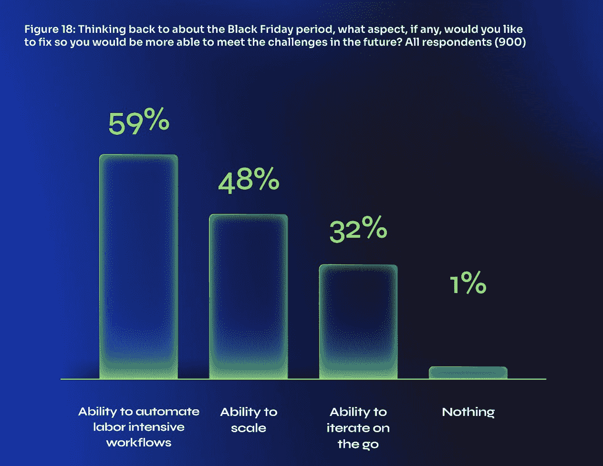

# 2023 年黑色星期五准备工作的 5 个考虑事项- Algolia 博客

> 原文：<https://www.algolia.com/blog/ecommerce/5-considerations-for-black-friday-readiness/>

很难想象在距离上一个黑色星期五不到 4 个月的时候还会有黑色星期五，但根据最近的[2023 年电子商务搜索趋势报告](https://www.algolia.com/dg/ecommerce-site-search-trends-2023/p/1) ，这正是许多零售商和电子商务公司正在做的事情。许多人已经开始寻找创新的方式来为即将到来的假期做准备。

## 黑色星期五自动化和规模化

黑色星期五对整个组织提出了巨大的要求。它也变成了一个移动的目标。2022 年，消费者和零售商在黑色星期五早早开始。交易提前了一个多月。消费受到大幅折扣的推动，这是消费者在跳过亚马逊(Amazon)和塔吉特(Target)等主要零售商的早期假日交易日之后等待的东西。

假日折扣和降价在 12 月销售额同比增长中发挥了关键作用，但它们不足以吸引消费者从 11 月开始表现出改善。但是，这并不意味着每个人都立即购买。与 2021 年疫情的高峰期相反，消费者愿意在旺季为商品支付更多费用，因为担心零售商会耗尽库存，[2022 年](https://time.com/6236987/black-friday-u-s-muted-inflation/)的消费者非常清楚库存过剩，并决定在等待最新和最大的交易时捂紧钱包。

这种动态——可能需要发布活动，并根据竞争对手、购买趋势、库存盛宴和饥荒做出快速改变——给公司带来了压力，要求他们找到应对挑战的解决方案。调查受访者表示，他们已经开始寻找自动化劳动密集型工作流的方法，帮助他们扩展并在移动中迭代。

## 黑色星期五技术注意事项

鉴于黑色星期五准备工作的复杂性，我们整理了一些值得考虑的建议。

*   保持一致性
*   混合人工固化和人工智能
*   胖头、矮胖中间和长尾优化
*   精确的即时分度
*   正常运行时间的性能和可扩展性

### 保持一致性

假日销售不仅速度快，而且充满活力，不断变化。很容易记住更新一件事，而忘记另一件事。除了寻找管理创意的数字资产管理解决方案，商家还需要考虑信息在哪里以及如何共享。

无论有人在使用你的搜索栏还是浏览产品列表页面(PLP ),黑色星期五的促销活动都需要保持一致，以最大限度地增加销售机会。这是搜索技术可以帮助的一个领域。许多 PLP 是完全动态的——它们实际上是查询——就像现场搜索结果一样。换句话说，你所拥有的系统应该能够将黑色星期五的销售商品推至搜索结果和 PLPs 的顶端。知道你准备的内容会被送到你的品牌买家购物的任何地方，这应该会让你松一口气。

哦，别忘了手机！移动搜索和 PLP 设计和交付需要快速响应，以最大限度地增加移动或沙发上买家的销售机会！

### 融合人工策化和人工智能

AI 在特定用例中表现非常出色。机器学习算法可以非常擅长预测和个性化。它可以大大增强您的团队正在做的工作，并以闪电般的速度计算结果，以便在正确的时间向正确的人提供正确的报价。尽管如此，有些时候你会想要掌控局面。

例如，您可能希望指导您的商品销售解决方案在目录的特定部分应用基于人工智能的优化，但手动管理其他区域。人工智能非常适合基于实时数据提升结果，例如将最畅销或高利润的商品推至顶部。另一方面，规则有助于创造身临其境的品牌体验和控制赞助项目。因此，在评估人工智能解决方案时，询问控制和灵活性。

### 胖头、矮胖腰、长尾优化

这个季节，你的买家会在你的网站上搜索“给娜娜最好的围巾”以及其他长尾和不常见的问题。这些长尾查询可能占你网站查询的 50-70%。它们难以预测，没有简单的方法来为它们写规则和同义词(比如“娜娜”是“奶奶”的同义词等等。).

更广泛地说，人们越来越多地按照自己的想法进行搜索，因此搜索解决方案应该能够解读查询意图，以返回相关结果。

当谈到黑色星期五的扩展时，搜索解决方案需要处理这些多种类型的查询——这就是端到端人工智能发挥作用的地方。

*   **查询理解** :搜索引擎需要自己解析查询。人工智能查询理解模型，如[自然语言处理(NLP)](https://www.algolia.com/blog/ai/advanced-keyword-search-is-built-upon-natural-language-processing-nlp/) 将使用句子编码、错别字容忍度和词汇化等功能来准备查询以供检索。
*   **检索** : [AI 检索](https://www.algolia.com/blog/ai/neural-hashing-ai-search-retrieval/)就是[矢量搜索](https://www.algolia.com/blog/ai/what-is-vector-search/)发挥作用的地方。向量是人工智能理解背后的技术，它们允许访问者按照他们的想法进行搜索。例如，即使你的网站上没有“红色闪闪发光”这个词，人们也可以输入“红色闪闪发光的衣服”并得到亮片衣服。向量是好的，但是对于规模，你也需要它有神经散列和关键字。这种组合有时被称为混合搜索，这是优化大范围查询的唯一方法——从肥头到长尾。
*   **排名** : [AI 排名](https://www.algolia.com/blog/ai/what-is-ai-search-ranking/)强化学习等能力会不断将更好的结果推至榜首。“更好的结果”是指获得最多点击、转换、购买、评级或其他积极信号的结果。

对于黑色星期五规模，人工智能“混合”搜索可以改善所有三种搜索的发现——从肥头到长尾。人工智能搜索不仅显示最相关的结果，还扩大了产品发现的足迹。嘿，谁不想让消费者更容易地要求 Alexa、谷歌或 Siri“在我的购物清单上为 nana 添加一条漂亮的围巾”，并将其放在我的[品牌名称]篮子中呢？

### 即时标引

许多零售商和市场每晚都会更新他们的搜索索引。有时每小时一次。更新对于反映最新的产品品种、价格、新的 SKU、库存水平等至关重要。您的搜索提供商需要能够处理频繁和大规模的变化，这也可能包括曲线球，如模式更新、客户评论、新商家等。，它需要在不影响搜索性能的情况下进行这些更改。在选择搜索提供商时，最好测试一下索引功能，以确保他们能够胜任假期的工作——这是对大规模速度的真正考验。请记住，如果你的买家找不到它，或者找到了不可用的东西，这不会带来好的结果。

### 正常运行时间的性能和可扩展性

黑色星期五给你所有的系统带来了巨大的限制。他们中的许多人要么无法扩展，要么需要准备不人道的开支。考虑这样一种架构，它允许企业在不增加 10 倍系统调整成本的情况下进行扩展。现代云体系结构允许您不必手动增加和减少专用基础架构。

在黑色星期五，网络延迟给零售商带来了真正的问题，因此，当务之急是通过现代基于云的架构，在网站上的所有服务中找到获得更快响应时间的方法。例如，基于 API 的搜索平台(如 Algolia)是限制您的商务和内容平台流量的有效方法，不仅适用于搜索用例，也适用于买家浏览 PLP 的情况。

黑色星期五可能感觉还很遥远，但它以一种令人惊讶和偷偷摸摸的方式很快就到了。当你为大销售活动做准备时，找到帮助你扩大规模和最大化利润的解决方案是很重要的。下载一份 [2023 年电子商务搜索趋势报告](https://www.algolia.com/dg/ecommerce-site-search-trends-2023/p/1) ，或 [联系我们](https://www.algolia.com/demorequest/) 了解更多关于 Algolia 可能提供帮助的信息。