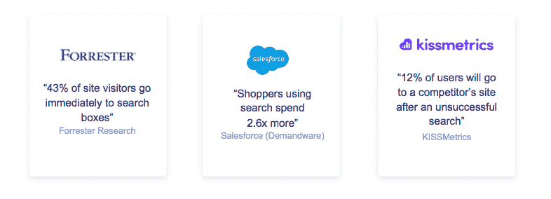
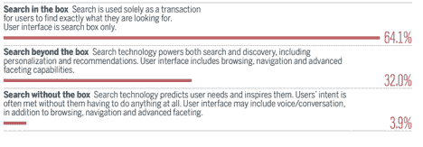
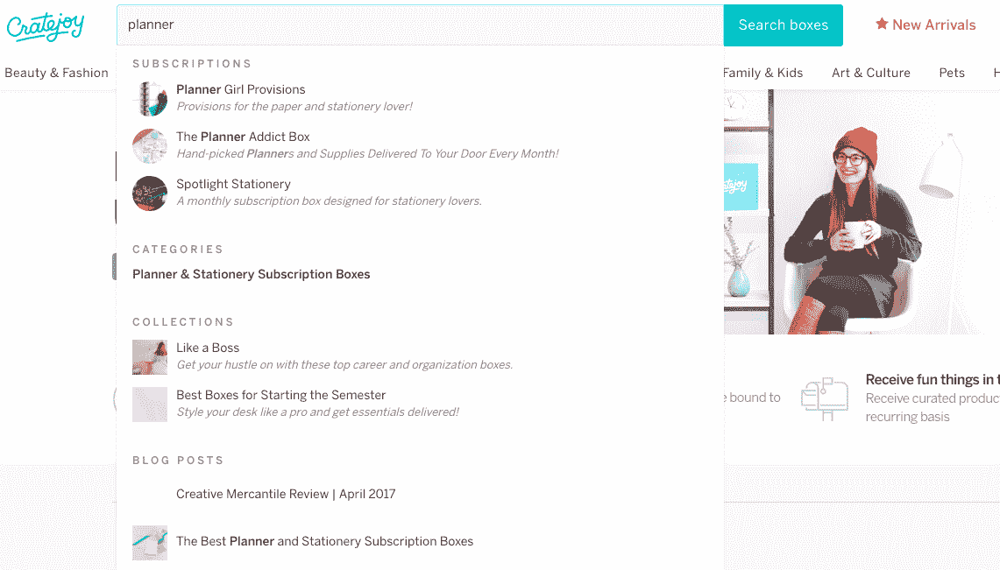
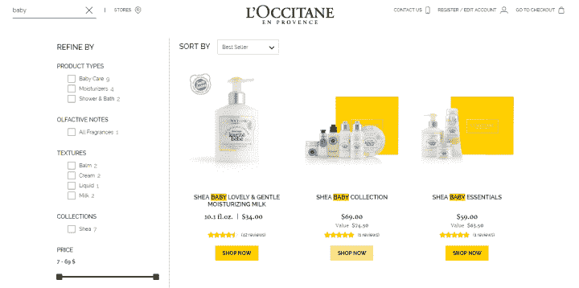
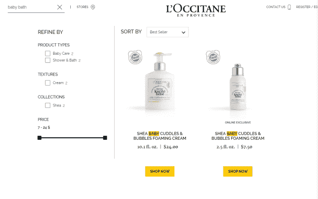
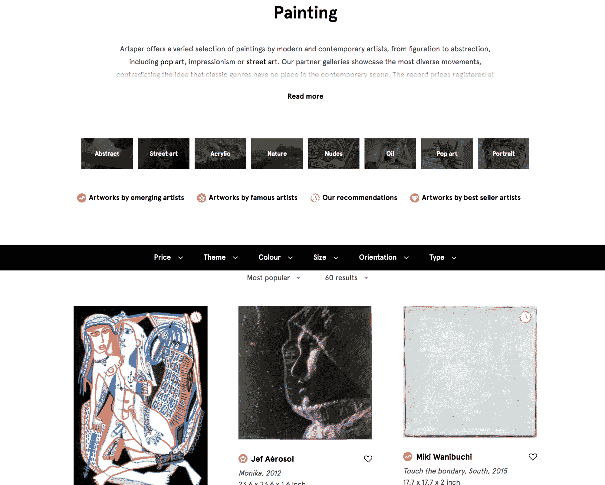

# 超越搜索栏:高级电子商务搜索体验- Algolia 博客

> 原文：<https://www.algolia.com/blog/ecommerce/advanced-search-experience-for-e-commerce/>

一种简单的、线性的搜索体验方法——客户在搜索框或搜索栏中寻找产品，然后要么加入购物车，要么退回——有两个缺点。首先，它对想要整体、个性化体验的现代用户来说是一种限制。其次，成本高。无法通过浏览、导航和高级界面等方式提供灵感的企业会错失转化和保留机会。

顶级零售商将搜索作为一种战略工具，用 Forrester 的话来说就是[，“…一种不注重技术，而注重易用性、有效性和情感的设计思维方式。”这提高了关键绩效指标，如转换率、粘性、参与度和篮子大小。](https://www.forrester.com/playbook/The+Digital+Customer+Experience+Improvement+Playbook+For+2018/-/E-PLA130#)

我们将探讨创新的方式，通过这些方式，技术可以为您的用户带来创造性的搜索体验和发现，并为您带来更好的业务成果。

## 为什么要提前进行网站搜索:快速查看数字

[互联网零售商 KPI&网站搜索调查](https://go.algolia.com/internet_retailer_survey)的受访者询问了 103 家电子商务公司网站搜索如何影响他们的 KPI，他们表示越来越看到他们的网站搜索和他们的顶线和底线指标之间的联系。

我们已经知道[网站搜索者转化](https://neilpatel.com/blog/site-search-killing-your-conversion/)的可能性比普通访问者高出 200%,但是看看这些统计数据:

Forrester 最近题为[“改造网站搜索以启动人工智能、聊天和个性化”](https://goto.algolia.com/l/139121/2018-11-26/2fbvtz)的报告证实，“医疗保健、零售、金融服务和其他行业的数字业务领导者必须掌握网站搜索的市场力量和选项，否则会危及他们投资的预期投资回报率。”

这些只是 88%的大大小小的零售商告诉互联网零售商推进他们的搜索策略很重要的部分原因。让我们来看看如何着手。

## 掌握搜索的基本经验

观察搜索成熟度模型的进展，我们发现 36%的零售商已经超越了框中搜索的简单交易模型。

但是在使用高级功能之前，搜索技术必须首先满足一些基本要求。被谷歌“宠坏”的消费者首先期待的是一个提供最相关结果的超快速搜索栏。

用户开始依赖三个方面的相关性:

### 1。语篇关联性

产品名称、品牌、描述中的关键词——我们称之为属性——构成了文本相关性[。文本相关性意味着正确地理解用户的意图，即使他们拼错了一个单词或使用了停用词(“the”、“and”、“at”、“with”…)。这也意味着给他们一个同义词结果(当他们输入“夹克”时提供一件皮大衣)，并确保复数被考虑在内(搜索“暖脚器”应该显示暖脚器)。](https://www.algolia.com/doc/guides/managing-results/relevance-overview/)

### 2。业务相关性

当你想推广某种产品时，比如说最近发布的产品或假日销售，你可以使用[业务相关性](https://www.algolia.com/doc/guides/managing-results/must-do/custom-ranking/)来影响用户看到的结果。您可以利用自己的业务指标，确保用户看到他们最有可能采取行动的内容。

例如，您可以跟踪产品的转化率，并希望首先显示转化率最高的结果。

### 3。个性化

个性化搜索体验就是从你的用户那里获取信号:他们通过与你的用户界面互动向你发送的有意识信号，以及来自他们过去偏好指示的更潜意识的潜在信号。

## 通过高级用户体验实现多种转化途径

了解了基础知识之后，让我们看看进步的零售商如何提供超越简单的顾客旅程:*搜索栏>点击>添加到购物车。*

### 提供多种内容类型作为搜索结果

[Cratejoy](https://www.cratejoy.com/) 是一个电子商务网站，用户可以很容易地订阅他们喜欢的产品。

如果用户在 Cratejoy 的搜索框中键入“规划者”，他们可以立即选择订阅、类别、与规划者相关的集合——或者，如果都不起作用，就进入博客帖子。这为用户提供了进入不同类型内容的多种途径，根据用户的个人偏好和处理信息的方式，这些内容转化为多种转化途径。

### 刻面:具有特殊智能的滤镜

[普罗旺斯欧舒丹](https://usa.loccitane.com/)是一家国际身体、面部、香水和家居产品零售商。与 Cratejoy 类似，他们的搜索是一种随你输入的体验，但他们有另一个有趣的功能，展示了高级搜索的可能性。假设用户在搜索框中输入“宝贝”:在左边，将会出现小平面。

刻面到底是什么？我们都熟悉过滤器，它是缩小搜索结果选项的一种方式。方面是与结果集交织在一起的过滤器:只有与结果集匹配的方面才会出现。这防止了“没有结果”类型的屏幕体验，这几乎普遍导致用户反弹。查看我们的“宝贝”方面，我们已经知道每个类别中可用的项目数量，以及价格。

如果用户将其搜索查询细化为“婴儿洗澡”，我们会看到可供她使用的类别已经减少，只显示适用的方面。

这意味着用户只需点击几下键盘，就能找到他们想要的东西。相比之下，标准的搜索栏体验有一长串的条目，这要好得多。

### 从超越搜索栏到没有搜索栏

艺术买卖网站 Artsper 认为搜索不仅仅是搜索栏。搜索技术为整个浏览体验提供了动力。

如果客户在主页上选择了“绘画”类别，产品和方面就会显示出来——即使没有输入搜索查询。

Artsper 还包括推荐类别；例如，顾客可以很容易地沉浸在抽象画中，也可以很容易地去掉滤镜。

这为什么这么有意思？不涉及用户的搜索栏查询，尽管幕后的搜索技术负责吸引人和自然的客户体验，包括排名和个性化推荐。

### 畅想电子商务搜索体验的可能性

最先进的搜索技术还有许多其他方面可以提升用户体验，改善你的业务数字:从推荐和动态分面到让用户定义界面。

在我们的电子书中了解更多:[框外搜索:提高电子商务转化率的创新用户体验](https://go.algolia.com/search-beyond-the-box)

我们希望能激发你加入顶级零售商的行列，通过搜索栏之外的搜索功能提升用户体验。您的用户应该通过浏览、互动、创新 UX 等方式享受强大的发现功能，缩短他们进入购物车的路径，同时推动您的业务成果。