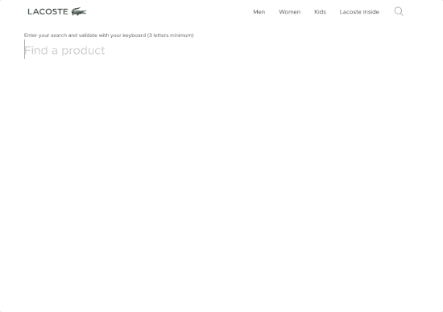
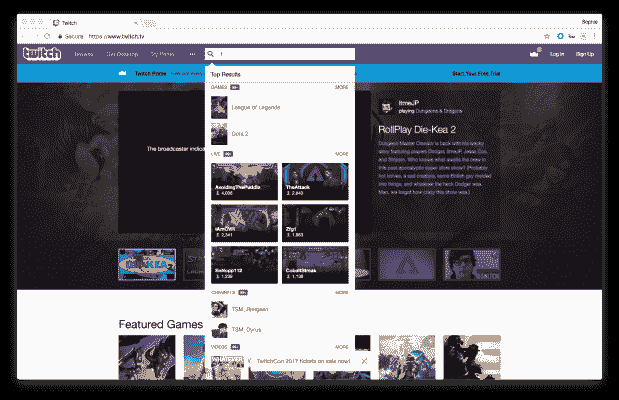
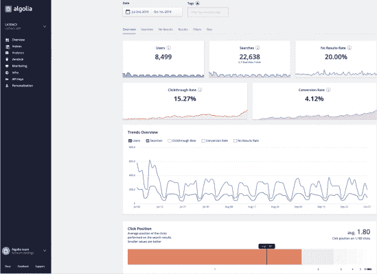

# 如何避免“无结果”页面| Algolia

> 原文：<https://www.algolia.com/blog/product/avoid-no-results-pages/>

随着像谷歌和亚马逊这样的网站提供即时和个性化的搜索结果，今天的网络用户希望他们访问的每个网站都有相同的体验。

但是返回“零结果”或“没有结果”页面的搜索是用户体验中令人沮丧的障碍。而且，通常情况下，他们会驱使访问者访问你的竞争对手的网站。通过对网站搜索引擎的战略性改进，你可以避免“没有结果”的页面，并确保你总是为用户提供一条前进的道路。

## 什么是“无结果”页面？

“无结果”页面是当内部站点搜索引擎不能定位与用户查询相关的任何内容时向用户显示的网页。

有时，确实没有任何产品或内容与查询相匹配。但是，对于很多站点来说，相关内容 *确实存在*——但是站点搜索没有 [优化得足够好](https://blog.algolia.com/learn-about-site-search-best-practices/) 找到匹配。

当用户遇到一个“没有结果”的页面时，他们通常会完全放弃这个页面或网站。如果你真的很幸运，他们可能会尝试重新组织他们的查询并再次搜索。但是注意力持续时间很短，提供一个“没有结果”的页面很快就会失去客户的兴趣(并可能失去他们的购买)。

## 为什么“没有结果”的页面不利于生意

“没有结果”页面对用户来说是个死胡同，因为它没有回答最初的查询，也没有给出有意义的替代建议。它既会让用户感到沮丧，又会以多种方式损害业务，包括:

*   **危害整体 UX。** 一个不返回结果的网站搜索无法实现将用户与他们需要的东西联系起来的基本功能。当用户没有得到他们需要的东西时，他们就不能与你的网站进行有意义的互动。
*   **破坏用户对网站内容的感知。当搜索失败时，用户可能会认为你没有提供他们想要的内容或产品。用户更有可能不了解你的网站所提供的一切就离开，这反映在搜索失败后的高跳出率上。**
*   **对 KPI 产生负面影响。频繁出现的“无结果”页面会对品牌本身产生负面影响。一个不合格的网站搜索给用户的感觉是，相对于竞争对手，该网站的服务质量很差。这导致跳出率上升，参与度和转化率下降，销售额下降等。**

## 繁体“无结果”页面无效

一些“无结果”页面通过提供一些关于如何更好地组织他们的查询的基本提示或者推荐一些常见的搜索来鼓励用户再次搜索。有时网页会包含幽默的图片来减轻不可避免的沮丧的搜索者的情绪。拥有充足客户服务资源的网站也可能会提供如何获得支持的信息。

然而，最终这些补救措施都是不够的。为什么？内部站点搜索引擎仍然没有满足理解查询和提供最相关结果的基本期望。

在许多行业，收购比以往任何时候都难，而且大多数网站的内容已经饱和。因此，现实是，如果游客不能很快得到满足，他们会离开去寻找其他东西。

## 微调你的站点搜索以消除“无结果”页面

任何普通的网站搜索都能返回结果。但是如果相关性没有被微调，用户将会遇到“没有结果”的页面，特别是对于不太常见的查询。通过调整相关性、语义设置和搜索引擎的其他组件，您可以完全消除“无结果”页面。

设计良好的网站搜索系统可以动态地分解复杂搜索的语义和结构，以提供最佳匹配。这允许引擎返回相关的结果，即使当查询拼写错误或者没有使用与相关产品列表或网页完全相同的术语。

Example of a complex query returning relevant search results

出色的网站搜索体验可以将不完美的用户查询转化为相关的结果。但是最好的网站搜索工具更进一步。当确实没有与查询相关的产品或内容时，搜索引擎应该推荐用户可能感兴趣的相关产品或内容，而不是针对预期查询的“无结果”页面。通过这种方式，你的网站搜索将访问者连接到他们知道他们需要的东西，以及他们还不知道他们需要的东西。

## 避免“没有结果”的 6 种方法第页

有很多方法可以优化搜索引擎，避免出现“没有结果”的页面:

### 1。构建你的同义词库

一个灵活的搜索引擎必须能够 [处理同义词](https://blog.algolia.com/inside-the-engine-part-6-handling-synonyms-the-right-way/) 来捕捉访问者可能引用同一条目的各种方式。例如，一家在美国销售汽水的公司必须能够应付来自中西部使用“pop”一词的顾客。因此，了解你的客户并把这些信息建立到同义词库中是很重要的。该信息可以与产品或服务相关的内容一起被索引。除了其他研究之外，使用你的网站搜索数据来了解哪些同义词是最重要的，哪些关键术语你可能会错过。

### 2。使用自动完成和查询建议

[自动完成](https://blog.algolia.com/search-autocomplete-on-mobile/) 搜索和查询建议当用户在搜索栏中键入时，提供推荐和备选查询。这有助于用户细化他们的搜索和/或发现新的查询，引导他们更快地找到他们所需要的。通过建议已知返回结果的查询，自动完成消除了搜索失败的可能性。

Example of a rich autocomplete that goes beyond search suggestions

### 3。确保你的网站搜索能够适应人为错误

人类经常拼错单词和误用标点符号。一个未优化的网站搜索将会被用户的错误绊倒，因此不会返回匹配结果。伟大的网站搜索系统必须 [处理错别字](https://www.algolia.com/doc/guides/managing-results/optimize-search-results/typo-tolerance/#typos-and-spelling-errors) 并过滤标点符号以提供最佳结果。但是，请注意，通常通过计算字符与最可能的单词匹配之间的距离来进行输入错误纠正，因此需要进行一些实验和监控，以确保系统不会过度纠正或不足纠正单词。

Example of a query with a typo returning relevant search results

### 4。个性化结果

用户历史可以为客户可能的搜索兴趣提供有价值的见解。通过使用诸如过去的搜索、购买和自我报告的兴趣之类的数据，搜索引擎应该能够更好地理解用户的搜索意图，并提供 [上下文相关的结果](https://www.algolia.com/doc/guides/personalization/what-is-personalization/) 。这也将增加点击率和转换率，因为用户更有可能对结果感兴趣。

### 5。基于业务需求定制您的搜索

虽然许多搜索功能可以跨领域推广，但也有一些因素是您的企业或行业所独有的。根据业务考虑因素(如网站的主要 KPI)以及客户优先级(如最畅销的产品),优化您业务的定制相关性。随着您细化搜索的相关性以满足业务需求和客户需求，搜索将返回越来越多的相关结果。

### 6。使用分析来了解客户需求

优化搜索是一个反复试验的过程。令人欣慰的是，每次用户与网站交互时，他们都会生成大量关于他们所需的有价值的数据。 [分析你的网站搜索](https://blog.algolia.com/internal-site-search-analysis/) 可以帮助你理解这些数据并据此采取行动。通过发现热门搜索、表现不佳的内容和受欢迎的产品，以及其他指标，您可以调整您的相关性，甚至填补内容空白。

Site Search data presented on Algolia Dashboard

## 如果真的有“没有结果”怎么办？

不幸的是,“没有结果”的页面最终还是会出现，即使是使用了很好的网站搜索。在这种情况下，尽快让用户回到相关内容并从错过的机会中吸取教训以改进未来的搜索是非常重要的。

在整个搜索体验中推荐产品是防止反弹的好方法，因为用户可以快速点击一个产品，而不必重新开始搜索。理想情况下，有了足够的用户数据，推荐的产品应该是上下文相关的，受欢迎的，以增加点击率。

因为搜索是一个持续的迭代过程，一个“没有结果”的浏览量应该是一个额外的数据点，以改善未来的实施。使用您的站点搜索仪表板定期查看返回零结果的搜索。有了这些信息，您可以决定是否需要调整搜索设置或创建新的内容或产品列表，以更好地满足这些需求。无论你做什么决定，确保“无结果”页面在此期间尽可能优化，这样你就不会失去有价值的客户。

## 如何为你的用户提供最相关的结果

“没有结果”的页面让开发者和最终用户都很沮丧。有了一个功能强大、经过优化的 [站点搜索解决方案](https://www.algolia.com/products/search-and-discovery/hosted-search-api/) ，你就可以轻松避免这种头痛。

在我们的 [媒体](https://www.algolia.com/industries-and-solutions/media/) 和 [电子商务](https://go.algolia.com/search-beyond-the-box) 电子书中了解更多优化搜索的好处。亲自了解如何通过智能搜索改善用户体验并满足您的业务目标。