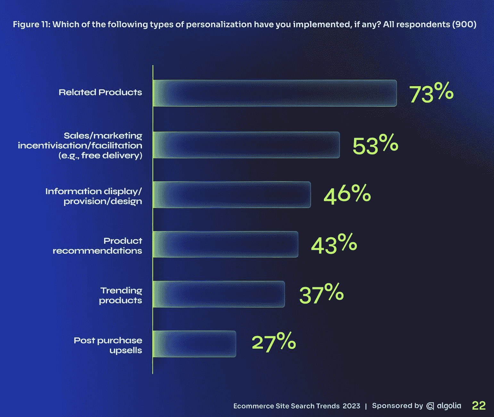
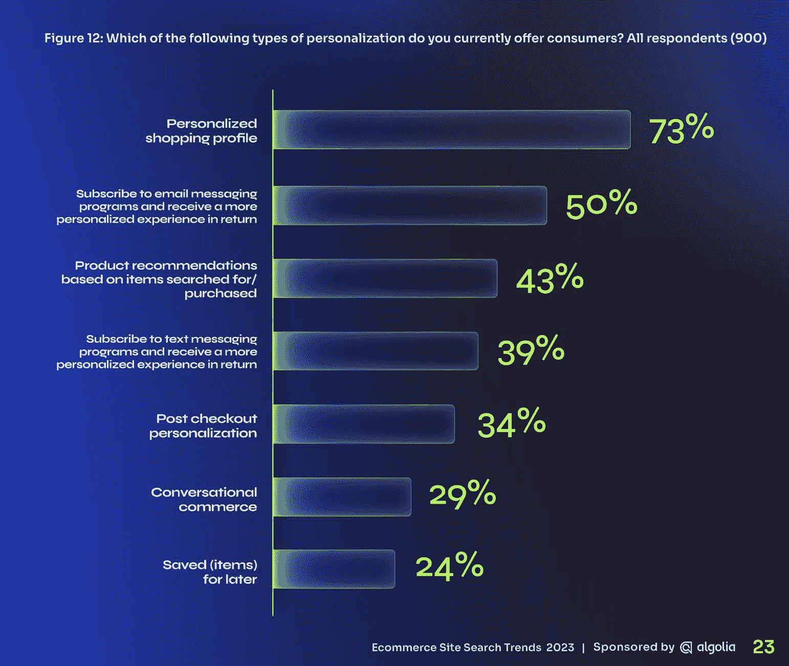
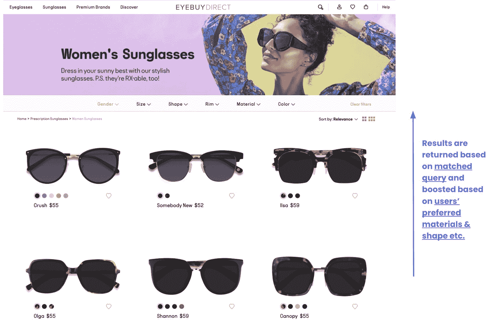
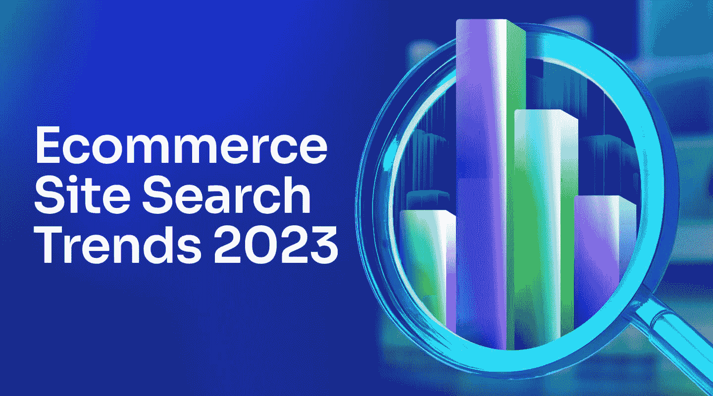

# 2023 年电子商务趋势:个性化- Algolia 博客

> 原文：<https://www.algolia.com/blog/ecommerce/ecommerce-trends-for-2023-personalization/>

Algolia 赞助了由科尔曼·巴夏礼研究公司制作和撰写的 [2023 年电子商务网站搜索趋势报告](https://www.algolia.com/dg/ecommerce-site-search-trends-2023/p/1) 。该报告基于对 900 名 IT 和商业决策者的调查，讲述了公司今年计划如何投资于搜索相关技术，包括电子商务个性化。

绝大多数受访者认可搜索对创收的重要性。他们还确定了它将如何影响许多渠道的个性化，包括文本和电子邮件通信、社交商务和购物车程序。

个性化是客户体验的一个重要组成部分，但还可以引入更多功能来最大化潜在回报。例如，近四分之三(73%)的人说他们已经实现了“相关产品”功能，这是最常见的个性化类型。除此之外，不到一半的人实现了任何其他类型的个性化。

许多受访者告诉科尔曼·巴夏礼研究公司，他们已经实现了一些个性化功能，如为客户提供设计个性化购物档案的方法，以开始接收个性化报价，43%的受访者表示他们根据搜索或购买的商品提供产品推荐。

许多受访者表示他们才刚刚开始。例如，56%的人说他们计划实施“保存项目以备后用”计划，42%的人说他们将很快提供短信订阅计划。

这只是提供个性化体验的冰山一角。大多数电子商务公司面临的挑战是利用他们拥有的第一方数据来构建个性化程序。

## 个性化是由数据驱动的

这并不是一个全新的战斗口号——Gartner 在 2018 年发布了其首个个性化幻方图，亚马逊在 2003 年发布了一篇 [论文](https://assets.amazon.science/76/9e/7eac89c14a838746e91dde0a5e9f/two-decades-of-recommender-systems-at-amazon.pdf) 进行推荐，而网飞在 2009 年以其[【100 万美元赏金](https://en.wikipedia.org/wiki/Netflix_Prize) 写了一个更好的个性化推荐算法。

个性化对消费者来说也很重要: [91%的人说](https://newsroom.accenture.com/news/widening-gap-between-consumer-expectations-and-reality-in-personalization-signals-warning-for-brands-accenture-interactive-research-finds.htm) 他们“更有可能去那些认可、记得并向他们提供相关优惠和推荐的品牌购物”对于卖家来说，个性化可以带来高达 25%的收入提升，更不用说更高的客户和品牌忠诚度了。

搜索技术和个性化有什么关系？实际上，很多。

*   现场搜索结果可以个性化
*   推荐也一样，现在可以由你的搜索引擎提供商提供支持
*   搜索相关数据是提供个性化结果的基础
*   用于网站搜索的机器学习正在推动许多创新
*   搜索数据可以为用户简档提供高度相关的意图信号

## 数据驱动的个性化

对于任何打算投资个性化的企业来说，它都是从数据开始的。

你收集的顾客和访客的人口统计学和心理学数据越多，你的个性化就越复杂。这包括如下数据:

*   位置(地理)
*   年龄
*   性别
*   以往购买记录
*   网站搜索历史
*   浏览过的页面
*   社交媒体喜欢
*   会员状态(如果您有会员或奖励计划)

它还可以包括浏览器和查看偏好等上下文数据、点击的电子邮件、奖励计划积分、点击的广告等非现场信息。

大中型电子商务公司已经开始投资构建数据湖，以存储、分析和利用全渠道营销接触点的客户数据，实现实时个性化。即使你没有投资于数据湖，许多电子商务平台自己也存储了足够的数据，可以用于个性化。

还有其他已经拥有大量客户数据的系统，例如您的搜索解决方案！您的搜索引擎正在生成和存储大量有价值的数据，这些数据可用于个性化和其他程序。它包括最近查看的类别和产品、最近的搜索、购买等内容。

您可以利用您的数据以多种方式实施个性化:

*   搜索
*   建议
*   浏览
*   相关产品
*   动态重新排名

您为搜索设置的相同个性化规则可以在任何地方实施。例如，在 Algolia 中，您可以使用产品仪表板为每个事件或属性分配值或权重，这反过来会提升搜索排名和动态目录和产品列表页面(PLP)中的个性化结果。

例如，EyeBuyDirect 网站上的购物者享受一致的、 [个性化体验](https://www.algolia.com/blog/customers/best-practices-for-ecommerce-personalization/) 。

当用户浏览到“女性眼镜”分类页面时，搜索结果会根据每个用户的独特偏好进行放大，例如镜架样式/形状或材料。偏好可以根据过去的购买或浏览历史来确定。它可以针对任何属性进行优化，这将因用例而异。当客户搜索、浏览网站或查看类别时，可以显示个性化的结果。一次制定规则，到处部署。

您还可以在推荐中添加个性化内容。推荐可以是一对多、一对一或两者的混合。例如，它可以包括“购买了 x 的客户也购买了 y”或“因为 *您* 购买了 x 和 y，我们认为您也会喜欢 z”。

在 EyeBuyDirect 的情况下， [早期结果显示](https://www.algolia.com/blog/customers/best-practices-for-ecommerce-personalization/) :

*   通过搜索、更多浏览和个性化服务，收入增加 4%
*   根据产品建议，转化率提高 1–1.5%

另一个例子:通过使用 [Algolia 的推荐](https://www.algolia.com/products/recommendations/) ，一个推荐引擎，客户能够带动一个收入提升 120 万美元。

Algolia 等解决方案中内置的新机器学习算法也将 [动态重新排列](https://www.algolia.com/doc/guides/algolia-ai/re-ranking/) 搜索查询结果，并应用个性化规则。这发生在个位数毫秒。当用户键入一个查询时，搜索引擎首先寻找相关性，然后它将应用重新排名来将更好的结果推到顶部——其中 *更好* 指的是个性化规则、商品销售、排名规则或其他因素的组合。

## 结论

从推荐到个性化搜索结果，用户体验创新有巨大的机会来推动收入和客户忠诚度。机器学习的进步已经扬起了风帆——个性化解决方案正在加速发展，比以往任何时候都更加强大。

这些个性化算法的背后是不同的机器学习技术，这些技术可以利用多次访问会话甚至单次首次用户会话的数据，识别预测的意图，并提供可清晰测量的个性化结果。 如果你想了解更多，你可以从下载免费的 [2023 年电子商务搜索趋势](https://www.algolia.com/dg/ecommerce-site-search-trends-2023/p/1) 开始。

