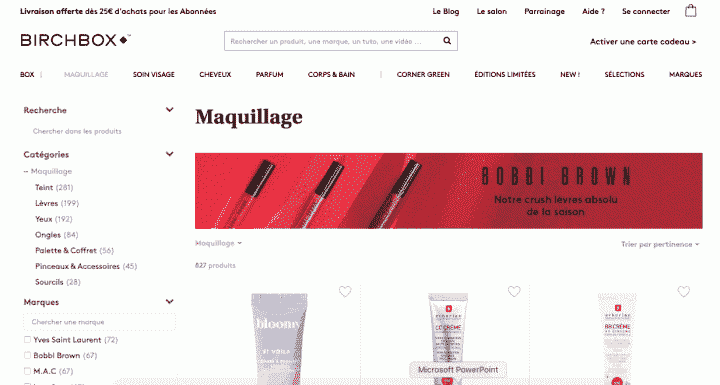
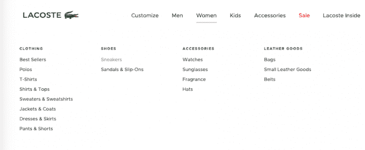
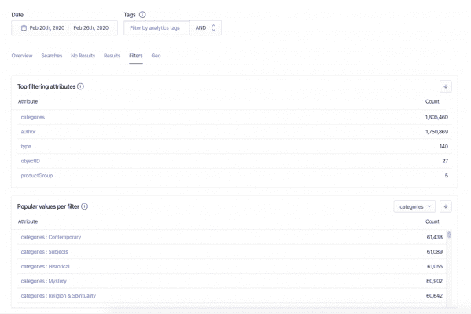
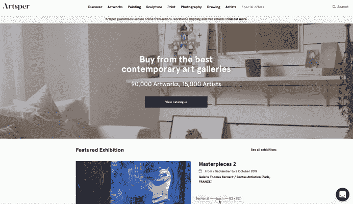

# 如何创建一个出色的多面搜索和导航体验| Algolia

> 原文：<https://www.algolia.com/blog/ux/faceted-search-and-navigation/>

今天的网络用户比以往任何时候都有更高的期望。他们希望你的网站设计精良，导航基于可预测的设计模式。如果不是这样，他们可能会感到沮丧，并在几分钟内转到竞争对手的网站——如果不是几秒钟的话。分面搜索是一个不可或缺的功能，它使搜索体验更加无缝，对用户更有帮助。

## 什么是刻面搜索？

分面搜索是一种搜索和导航功能，允许用户通过选择一系列不同的属性来根据自己的兴趣调整搜索结果。这些属性通常被组合成预定义的方面，如下所示，这些方面是由企业选择的粒度。

分面搜索通常被视为一种过滤。过滤器的范围通常更广，通常可以帮助用户在不进行搜索的情况下对内容进行细分(例如，“女装”或“童鞋”可能是电子商务网站上的过滤器)。每个过滤器，如下图所示，可能会产生数百或数千个产品，这可能会让用户手动浏览感到沮丧。

然而，分面搜索允许用户更有意识地细化他们的搜索。搜索“女装”的人可能还想用面过滤器缩小搜索结果，比如颜色、尺寸、价格范围等等。分面搜索和导航工具为用户提供了快速搜索的能力。

## 为什么分面搜索对导航很重要？

在线消费者对网站性能有很高的期望，而 [不会容忍缓慢或笨拙的界面](https://www.searchenginejournal.com/website-bounce-rate/332439) 。

分面搜索和导航是优化搜索的重要组成部分。通过消除用户在看似无穷无尽的结果中滚动的需要，它减少了用户连接到他们想要的东西所需的时间。这促进了更好的用户体验，这对于屏幕空间有限且网络连接较慢的移动设备尤为重要。快速而直观的探索过程可以促进更多的用户参与和更高的转化率，以及其他好处。

以下是多面搜索为高效直观的用户体验提供动力的另外三种方式:

1.  **向用户展示有哪些产品和内容** 。当用户浏览您的站点并选择面时，会向他们介绍您的目录的特性。刻面可以将用户的注意力吸引到品牌、风格、尺寸和其他他们可能会忽略的属性上。有了新的知识，他们就可以自信地浏览你的网站，搜索新的商品。
2.  **减少了多次搜索的需要。** 使用分面搜索，如果客户没有立即找到符合其规格的产品，他们不需要仅仅为了找到产品而不断改变和试验他们的搜索查询。他们需要做的只是应用正确的方面来更接近他们的需求。根据所选择的项目或类别而变化的上下文方面对于用户来说特别有帮助。
3.  **使大型内容目录更易于管理** 。在过去，产品和内容管理者不得不考虑缩减他们的产品，以允许客户浏览他们提供的一切。通过分面搜索，用户可以浏览更多的内容，为商家在网站上销售更多商品打开了大门。

## 刻面搜索和导航提示

良好的分面搜索和导航体验需要仔细的规划和迭代。这样做时有几个重要的注意事项:

### 考虑客户

你网站上的 facet 过滤器应该满足尽可能多的用户的需求和兴趣。为了打造最好的多面搜索，你需要了解你的用户在搜索什么以及如何搜索。 [搜索分析](https://blog.algolia.com/internal-site-search-analysis/) 是另一种强大的方法。通过跟踪流行的搜索关键字和指标，如点击率，您可以看到用户如何参与您的内容，以及可以添加哪些类型的方面来更好地满足他们的需求。

不要忘记包括基于社会证据的方面，如评论和评级，这可以引导客户接触新事物，同时建立他们对你网站上的产品和服务的信心。

### 优化刻面数量

虽然满足客户需求是必须的，但不要有太多 *选项也很重要。 [选择正确的刻面数量](https://www.earley.com/blog/faceted-search-how-many-facets-too-many) 将取决于您的用例以及用户的熟练程度。大量的方面，特别是如果有几个不必要的或未使用的方面，会使用户不知所措。当分析你的搜索数据时，你应该意识到哪些方面没有被使用，并在持续的基础上对它们进行修整。还要注意的是，facet 选项应该随着用户输入的内容而改变，只包含相关的选项。例如，当用户搜索一件衬衫时，facet 选项应该包括颜色、价格和品牌，但不应该包括鞋号过滤器。*

### 允许一次选择多个面

如果您的内容目录很大，很可能单个方面的选择不足以缩小结果范围，让大多数客户找到他们想要的内容。然而，有了多方面的选择，他们更有可能做到这一点。例如，在大型电子商务网站上搜索一件蓝色衬衫可能会产生数百个结果，而搜索一件 20-30 美元之间的蓝色女式小 t 恤会精确得多。

### 使用主题滤镜

主题过滤器是更主观的内容分组。例如，对于一个电子零售商来说，女装的主题过滤器可能包括“假日”、“工作”、“休闲”或“派对”等选项。虽然范围不像其他类型的过滤器和方面那样狭窄，但是主题过滤器将用户引导到特定类型的产品。通过捕捉特定的情绪或口味，它们有可能比传统方面更好地捕捉和匹配用户意图。它们还可以为更被动的浏览器提供一个很好的起点，开始他们的探索过程。一旦这些用户找到了与他们相关的主题，他们就可以通过其他方面进一步缩小范围。下面的体验不是由 Algolia 提供的，但它是主题过滤器的一个很好的例子。

### 显示与用户选择的方面相匹配的结果数量

显示结果的数量有助于向用户表明他们的搜索查询和方面选择有多有效。此外，通过在未选择的方面旁边提供这些计数，这些用户还可以看到哪些最有可能让他们最快地获得他们想要的内容。虽然用户的搜索通常会涉及到许多方面，但如果排序正确，用户只需使用其中的一个子集就可以充分缩小搜索范围。

## 通过精心制作的分面搜索和导航超越您用户的期望

为了向您的用户提供引人入胜的高性能搜索体验，您需要设置和监控一个设计良好的内容分面和过滤系统。这就要求搜索作为一个服务合作伙伴，能够提供所有必要的工具来满足用户期望的行业标准。查看我们的电子书“ [搜索超越盒子](https://go.algolia.com/search-beyond-the-box) ”，了解搜索如何帮助用户发现内容并推动业务成果。