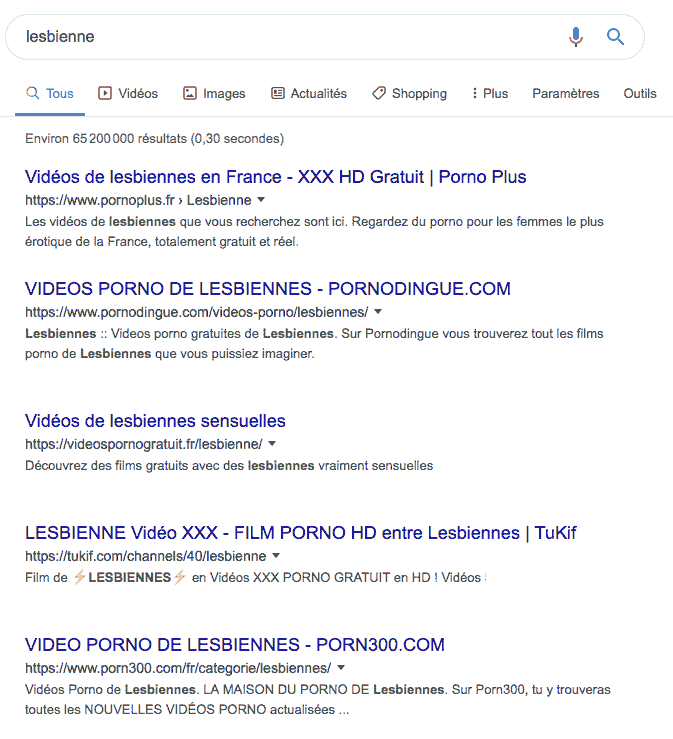
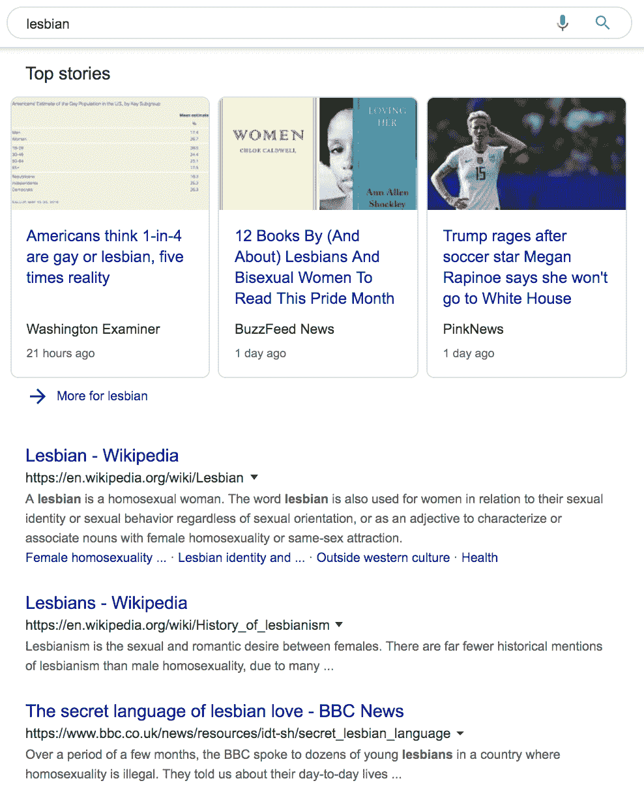

# 寻找“女同性恋者”-阿尔戈利亚博客|阿尔戈利亚博客

> 原文：<https://www.algolia.com/blog/algolia/looking-for-lesbians/>

在网上搜索“女同性恋”这个词就像走过一个雷区。输入“拉拉”，回车，你极有可能被色情淹没。添加一个像“医疗服务”或“事件”这样的词，你就会得到对女同性恋友好的医生和事件的信息。错误地输入“gyno”(例如，“gyon”)，或者添加像“女同性恋性行为”这样的模糊搜索词，你就会被带回到与女同性恋相关的色情信息中。

在搜索与女同性恋相关的信息时，必须筛选色情内容，这创造了一种令人不满意、尴尬甚至令人不快的搜索体验。这也传达了一个错误的印象，*默认，*女同性恋内容是色情的。我们很容易理解为什么 LGBTQ+社区指出这是一个可见性问题。

**对于 Algolia 来说，骄傲月似乎是一个通过搜索技术来看待这个问题的好时机，可以让人们了解这里正在发生的事情以及如何解决这个问题。**

Algolia 为个人网站提供网站搜索。网站搜索依赖于结构化的内容，或者至少以一种已知的方式格式化内容，这与网页搜索相反，网页搜索的内容很大程度上是非结构化的和不可预测的。通过格式化和结构化数据，Algolia 让客户能够根据内容的含义控制过滤、排名和选择内容，从而将成人内容与其他内容分开。这对谷歌来说难度更大。为了理解为什么，让我们比较一下我们和谷歌的做法，看看采取什么步骤来解决这个问题。

## 知道你的数据

为了更好地组织您的数据，您需要了解您的数据。当你知道你的数据，你可以命名和分类它，并把每一个项目放在一个特定的背景下-医疗，娱乐，色情。这使得[能够过滤](https://www.algolia.com/doc/guides/managing-results/refine-results/filtering/)，这是一个强大的工具，让用户能够控制他们看到的东西。**了解数据使网站所有者能够挑选和选择他们的数据的哪些部分被搜索，优先考虑一些数据，调整措辞，添加同义词，并应用许多其他类似的工具，以获得对搜索引擎的更大控制。**例如，我们的客户可以使用[定制排名](https://www.algolia.com/doc/guides/managing-results/must-do/custom-ranking/)来影响搜索结果的顺序。

这就是 Algolia 为*站点*搜索提供的功能，网站所有者知道网站的内容。

## 搜索引擎优化

谷歌没有这种控制，因为他们不提供与 Algolia 相同的服务。作为一个*网络*搜索引擎，**谷歌不知道也不可能知道它搜索的数据。**

相反，谷歌使用的排名算法通常被称为炼金术或魔法；虽然他们没有泄露他们的秘密，但他们确实提供了一套技术，网站所有者可以用这些技术来提高他们的排名，从而增加他们的网络流量和在网络上的存在。这些技术被归类在 SEO(搜索引擎优化)标签下。我们一直都能看到 SEO 的效果。例如，一些网站比其他网站更受青睐，名/姓组合首先返回名人，并且总是很容易找到某人的 LinkedIn 帐户。

所以还是回到正题吧。“女同性恋”这个词的流量很大程度上是寻找色情作品的流量。根据[最受欢迎的色情网站](https://www.pinknews.co.uk/2018/12/12/lesbian-porn-popular-2018/),“拉拉”一词是搜索的第一名。你可以看到，如果谷歌应用简单的基于流量的流行度算法——比如，总是首先显示访问量最大的网站——这是如何无法解决的。

幸运的是，SEO 要复杂得多。SEO **为网站所有者和社区提供方法来提高他们自己的网站和他们所代表的社区的排名。**

出于我们的目的，搜索引擎优化将是一个工具，用于在搜索“女同性恋”一词时生成相关内容。也许有一些想法值得探索，让“女同性恋”的搜索体验更相关，更少冒险。

## 几个念头

### 利用热门网站

利用像[维基百科](https://en.wikipedia.org/wiki/Lesbian)和其他非色情、高流量网站(如医疗网站、新闻和娱乐媒体)这样的强势网站的流量可能是一个建议。我们所说的利用，是指在这些网站上增加更多关于女同性恋者的信息，并更加一致地使用“女同性恋者”一词和其他重要术语。

本质上，这意味着给每个官方网站增加更多值得信赖的内容:。网，。gov，。edu。org 等等。

### 结构化内容

另一个选择可能是 **[构建网站](https://yoast.com/ultimate-guide-content-seo/)，其中包含对女同性恋者重要的信息或服务**。关键网站需要展示它们的内容，这样谷歌就能更容易地理解它们，也能信任它们。大公司雇佣 SEO 专家对网站的每一个字和每一页提出建议。大多数建议包括一致的术语、较小的网页、简短、清晰的文本和微数据的巧妙使用(谷歌为网站添加清晰定义的结构的方式)。这个列表并不详尽

### [反向链接](#backlinking)

这是社区发挥最大作用的地方。对于谷歌来说，这代表了社区内的内部链接(称为“[反向链接](https://en.wikipedia.org/wiki/Backlink)”)。社区内的网站需要相互超链接，以便更好地浏览。这在这些网站上建立了更重要的存在，也在整个社区中建立了更多的信任。**反向链接将内容结合在一起，形成一种集体声音。**

### Meta 标签

虽然谷歌已经对元标签失去了一些信心，但由于滥用和伪造，仍然有一些关键的元信息需要你自己关注，例如每个页面上的`title`和`description`标签。

### 没有保证

请注意**这些建议并不保证**。你做的任何事情也是色情网站所有者做的。这是一场竞争激烈的竞争。你的努力必须是严格和不懈的。

## 女同志, Lesbian, Lesbienne, lesbiyanki, समलैंगिकों, …

有趣的是，并不是每个国家都有相同的行为。例如，英语国家没有这种经历，但法语和俄语国家有。印地语只显示骄傲游行的链接。不知何故，每个国家都有不同的结果。

我们无法确切知道这是为什么。有人说，这是因为谷歌在后台为这个和其他类似的潜在攻击性歧义打开了安全搜索。[世界各地的团体正在组织起来](https://twitter.com/SEO_lesbienne?lang=fr)提高人们的意识。如果我们根据上述建议考虑这些差异:

*   英语单词“拉拉”在网络上很普遍——尤其是在维基百科和 WebMed 等网站上，以及所有的新闻和娱乐媒体上。相比之下，“lesbienne”这个词在维基百科上的拼写不同(“ [lesbianisme](https://fr.wikipedia.org/wiki/Lesbianisme) ”)。你会想要修改维基百科，使其更一致，更符合普通用法。
*   美国的 LGBTQ+社区比其他任何国家都更大，资金也更充足，因此它可以聘请 SEO 专家来确保对女同性恋友好的内容是结构良好的、优化的和完全反向链接的。

所有这些都有所不同。

## 骄傲！🔎👭

毫无疑问，你可以在网络上创造出“拉拉”这个词的另一种含义。谷歌的机器学习速度很快，尽管排名算法有时确实很神秘，但它远比简单的“流量”算法更智能、更细致。搜索引擎不是交通警察，被所有超速行驶的司机撞倒，以寻求廉价的刺激。搜索引擎可以发现竞争的声音，并帮助他们被听到，但你必须知道如何获得并保持他们的注意力。