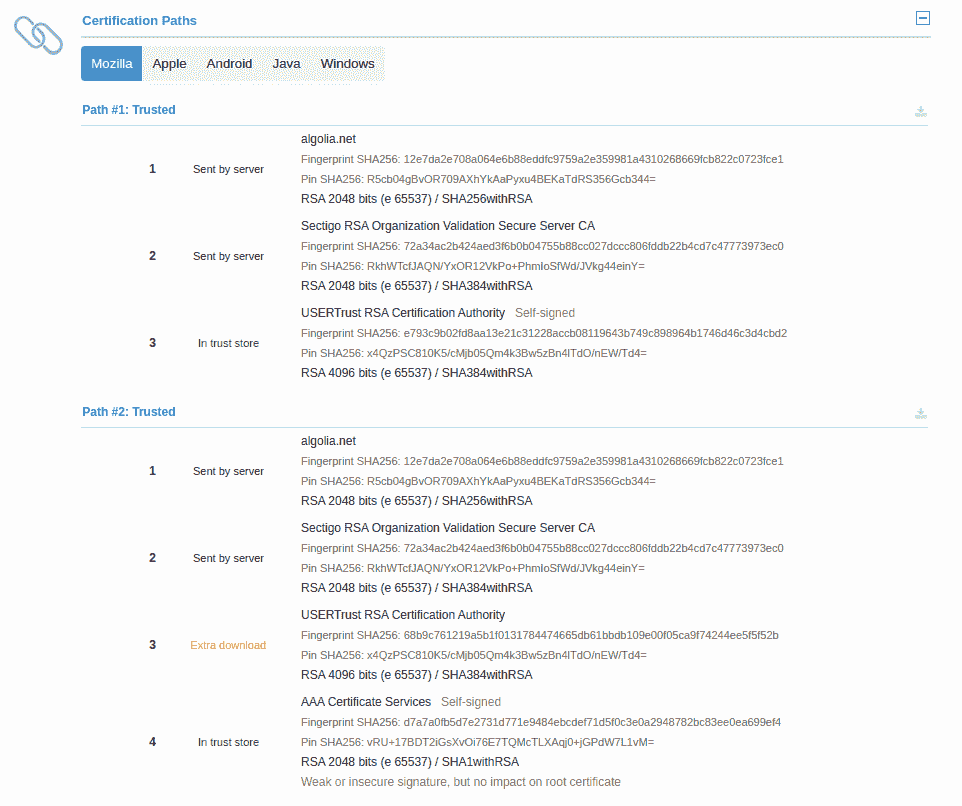

# 5 月 30 日 SSL 事件- Algolia 博客

> 原文：<https://www.algolia.com/blog/engineering/may-30-ssl-incident/>

| **总结和关键要点**

*   两个根证书颁发机构于 2020 年 5 月 30 日到期。
*   我们的一些客户经历了长达 1.5 小时的服务中断(如果他们有过时的 OpenSSL 库)，其他客户经历了长达 3 小时的服务中断(如果他们也有过时的证书存储)。
*   该问题已完全缓解，每个人的服务可用性都已恢复。
    虽然与 OpenSSL、HTTPS 和 PKI 证书有关，但这不是一个安全事件。

 |

2020 年 5 月 30 日 10:48 UTC，我们在互联网的公钥基础设施中经历了一个罕见的情况，两个根证书颁发机构过期，一个被另一个交叉签名。

理论上，这没什么不寻常的。证书随时都会过期(如果使用 Let's Encrypt，通常会在一年甚至 90 天内过期)，证书颁发机构会在许多年后过期一次。但是在 5 月 30 日，即将到期的认证机构暴露了一个潜在的问题，使得我们的 API 对我们的一些客户不可用。

5 月 30 日，在 UTC 时间 10:48 认证机构过期后一分钟，我们的站点可靠性工程(SRE)团队收到通知，我们的服务存在证书问题。这是一个意外的消息，因为我们仔细检查我们的证书是否有效，不会很快过期。浏览器中的快速验证也确认了一切正常，API 响应正确。然而，来自不同服务的第二个警报通知了 SRE 团队，再次声称证书已过期。浏览器中的另一个验证再次确认了该服务正在工作并有响应。出于某种原因，Pingdom 监控服务发现证书已经过期，但是浏览器中的一切都正常。

查看我们的基础设施上的流量图，我们注意到 API 调用的数量有所减少，但并不接近于零。当事情不完全正常时，通常比在一些事情正常而另一些事情不正常的情况下更容易发现什么不正常。

当我们从装有 macOS 的笔记本电脑的命令行测试受影响的服务时，调查的方向很快发生了变化。突然，一个简单的对域名的*卷曲*失败了，说证书无效。我们发现了一些东西，Qualys SSL 实验室扫描仪显示了许多有趣的东西:

1.  我们的证书是有效的。
2.  我们的中级证书颁发机构 Sectigo RSA 组织验证安全服务器 CA 的证书是有效的。
3.  在路径 1 中，根证书 user trust RSA certificate Authority 是有效的，并且整个链是有效的。
4.  在路径 2 中，我们的根证书颁发机构 USERTrust RSA 证书颁发机构的证书于 5 月 30 日 10:48 UTC 到期。
5.  根证书颁发机构 AddTrust 外部 CA 根的证书交叉签名 USERTrust RSA 的证书已于 5 月 30 日 10:48 UTC 过期。

这是一个有趣的情况。有一个到 USERTrust RSA 证书颁发机构的有效路径，也有一个过期路径。浏览器能够找到有效的链，但是 curl 找不到它。Qualys SSL 实验室测试显示系统正在运行，证书配置工作正常。

我们用现有信息更新了状态页面，安排专人回复我们支持邮箱收到的电子邮件，并开始着手缓解我们认为是问题根源的问题。

在我们的测试环境中，我们验证了从服务器提供的证书链中删除过期的证书是一个好方法。服务器仍然可以从浏览器访问，现在甚至 curl 在命令行中也能够验证证书链并允许请求通过。这是一个很有前途的解决方案，值得部署到生产环境中，因此我们开始着手部署。

当这种变化影响到第一批生产服务器时，我们看到流量水平恢复到了我们当时的预期水平。随着每一个额外的服务器获得现在更短版本的证书，情况变得越来越好，直到我们认为一切都完成了，我们可以结束这个事件。然而，仍然有一小部分客户告诉我们，他们无法验证证书并连接到 API。

带着这种想法我们又回到了 Qualys 测试的新配置: 

如上所述，测试表明有一个有效的可信路径，以及一个以前不可见的新的可信路径——这次不是在 AddTrust 外部 CA 根处结束，而是在 AAA 证书服务处结束。这条新路从何而来？事实证明，USERTrust RSA 证书颁发机构证书有 3 个版本:

*   自签名根证书颁发机构版本创建于 2010 年
*   由 2000 年创建的 AddTrust 外部 CA 根版本交叉签名
*   由 2019 年创建的 AAA 证书服务版本交叉签名

当时的情况是，我们的绝大多数客户现在从他们的证书存储中识别自签名根版本，我们无法使用 AddTrust，只能使用 AAA 证书服务。不清楚为什么自签名版本没有被所有地方识别，因为它已经在常见的证书存储中存在了一段时间。快速查看 AAA 证书服务证书后，发现它创建于 2004 年，很有可能它存在于更多的证书库中，并且存在的时间更长。

我们的 SRE 团队开始部署对我们的公共证书的第二次更改，尝试为剩余的客户恢复服务，并在部署后不久与他们确认他们可以再次获得服务。这一事件现在终于结束了，所有客户的服务都恢复了。但是，为什么我们的一些客户在 Qualys 扫描仪显示证书有效时却失去了访问权限呢？

证书确实是有效的，并且整个证书链是由 Comodo/Sectigo 证书颁发机构正确生成的(在周末使任何证书过期都不是一个好的做法，使证书颁发机构过期也不是一个好的做法，因为它有叶子证书，但是从技术上来说，这是正确的。)没有预想到的是客户端库将如何处理这种情况，主要是为地球上绝大多数 HTTPS 提供动力的 OpenSSL。在分析事件的过程中，我们在[发现了 2014 年](https://git.openssl.org/gitweb/?p=openssl.git;a=commit;h=0930251df814f3993bf2c598761e0c7c6d0d62a2)的一个有趣的 OpenSSL 错误，它说:

*尽可能不要使用过期的证书。*
*查找证书颁发者时，如果当前候选人已过期，继续查找。如果找不到有效的证书，只返回过期的证书。*

这意味着在实现这一更改之前，每当 OpenSSL 在证书链中检测到无效证书时，它都会声明该证书无效并拒绝连接。实现这一更改后，OpenSSL 会跳过过期的证书，并正确地继续寻找可以证明证书有效的其他证书。这个微小的变化适应了证书链的性质——一个证书颁发机构可以由多个证书颁发机构签名，其中一些仍然有效，一些不再有效。一切看起来都很好，那么为什么会有影响呢？
进一步挖掘，对 OpenSSL 的这一更改只是 OpenSSL 1.1.1 的一部分，而不是 OpenSSL 1.0.x 的一部分。例如，这意味着 Ubuntu 16.04 和更旧版本、Debian 9 和更旧版本、CentOS 7 和更旧版本或 RedHat 7 和更旧版本的所有版本都受到影响，但所有这些仍然是普遍支持的版本，至少从安全角度来看是这样。在我们的 macOS 笔记本电脑上，我们使用的是 [LibreSSL](https://www.libressl.org) 2.x，LibreSSL 3.2.0 的发行说明中也有类似的提及:

**构建证书链时首先使用未过期的证书。*

我们现在必须等待新的 LibreSSL 出现在 macOS 的新版本中。

但是为什么浏览器能够正确地验证证书呢？浏览器自带了自己的 SSL/TLS 库和自己验证 PKI 的方式。Chrome 搭载了 BoringSSL，Firefox 搭载了 NSS，独立于底层操作系统的 SSL/TLS 库，没有同样的 bug，更新更加频繁。

现在，我们终于全面了解了发生了什么，为什么只有一些客户的后端实施受到影响，为什么有些系统的证书存储已经过时，需要更旧的根证书。

下一步是什么？我们正在联系受影响的客户并解释发生了什么，我们正在改进我们的证书检查工具，以验证整个链中的过期情况，而不仅仅是我们的叶证书。最后但同样重要的是，我们将把 OpenSSL 包括在我们的年度开源捐赠中，并将在财政上支持 OpenSSL 团队的工作。

—————–

**常见问题解答**

*   **服务不可用是由 Algolia 服务器上的问题引起的吗？**
    不，该服务继续工作，仅对于过时的系统不可用。
*   **我应该怎么做才能避免 Algolia 或其他服务将来出现类似情况？**
    将你的 OpenSSL 至少更新到 1.1.1 版本，将 LibreSSL 至少更新到 3.2.0 版本。还要更新你的证书库，在 Linux 上通常是“ca-certificates”包。
*   **Algolia 的证书过期了吗？**
    不，Algolia 的证书没有过期，仍然有效。过期的是签署我们证书的三分之一版本的证书颁发机构。
*   **是否有其他提供商受到影响，或者该问题是 Algolia 特有的？不幸的是，其他供应商也受到了影响:Heroku、Stripe、kernel.org、Datadog、Gandi.net 等等。**
*   **对客户有什么影响？**
    我们检测到大约 10%的应用集群受到大约 1.5 小时的影响。在这段时间之后，有个位数的客户受到了长达 3 个小时的影响。在此次事件中，没有来自浏览器的搜索查询受到影响。