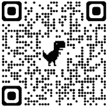
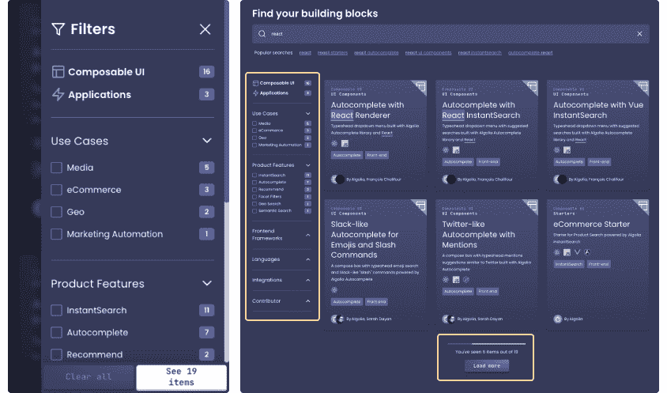

# 在 React | Algolia \n 上发布我们的 PWA 电子商务 UI 入门套件

> 原文：<https://www.algolia.com/blog/ecommerce/pwa-ecommerce-ui-starter-kit-in-react/>

**使用 React / Next.js 入门套件获得灵感并加快店面实施。**

任何构建了端到端搜索和发现体验的人都知道，创建一个健壮的前端界面是多么困难，它不仅要满足软件开发标准，还要满足最终用户在速度和 UI/UX 最佳实践方面的期望。特别是当这些体验同时服务于多个设备时，尤其是移动设备，这代表了 2021 年 B2C 电子商务中超过 60%的网络流量 [。](https://contentsquare.com/blog/2021-digital-experience-benchmarks-by-industry/)

几年来，我们的团队一直在[instant search](https://www.algolia.com/doc/guides/building-search-ui/getting-started/js/)和[Autocomplete](https://www.algolia.com/doc/ui-libraries/autocomplete/introduction/what-is-autocomplete/)库中投入时间和资源，以提供 UI 组件，开发人员可以使用、定制和扩展这些组件来编写他们的界面。我们很自豪能够为数以千计的客户提供支持，并期待未来能够提供更多支持。

尽管有这些图书馆，但要打造一个好的体验，还是需要大量的时间和专业知识。客户仍然需要弄清楚如何将我们的组件插入到他们独特的 UI/UX 设计和技术中。

## 以模板开始，而不是空白的页面

我们很高兴推出我们的第一个用户界面模板，主要针对电子商务。UI 模板是一个使用[React](https://reactjs.org/)/[next . js](https://nextjs.org/)的店面实现，您可以将其用作构建基于 Algolia 的解决方案的入门工具包，也可以将其用作教育和灵感资源，从中挑选一些代码。

### 现场预览

 <https://res.cloudinary.com/hilnmyskv/video/upload/v1639393886/blogposts/pwa_ecom_ui_template_v1_desktop_preview.mp4>

<https://res.cloudinary.com/hilnmyskv/video/upload/v1639393886/blogposts/pwa_ecom_ui_template_v1_desktop_preview.webm> 

在我们深入研究如何构建 UI 模板以及软件包中包含的元素和组件之前，让我们后退一步，从最终用户的角度来考虑一下。点击下面的实时预览，在您自己的设备上测试体验。

*或者从你的手机里扫描出来*

## 功能&技术概述

我们构建了以最终用户体验为核心的 PWA Ecom UI 模板，特别注意尽可能使其为生产做好准备。UI 模板的实现得益于以下技术:

*   使用带有功能组件的 React 钩子的最新版本
*   包含 SEO 优化(服务器端渲染使用[next . js](https://nextjs.org/)，SEO 友好生根)
*   是[PWA](https://web.dev/progressive-web-apps/)兼容
*   在 WebCoreVitals 和 Accessibility 上得分> 90%(通过 [灯塔](https://developers.google.com/web/tools/lighthouse) )
*   是用 [打字稿](https://www.typescriptlang.org/) 和 [顺风 CSS](https://tailwindcss.com/) 进行主题化

从功能的角度来看，该 UI 模板的当前版本侧重于以下领域的搜索&发现体验:

*   首页，重点发现
*   产品列表页面，将搜索&浏览统一到单一体验中，允许最终用户通过结合基于关键字的搜索和基于方面的导航来自然地导航产品。

此外，将 Algolia[autocomplete . js](https://www.algolia.com/doc/ui-libraries/autocomplete/introduction/what-is-autocomplete/)和[React instant Search](https://www.algolia.com/doc/guides/building-search-ui/what-is-instantsearch/react/)集成到模板中，我们不仅可以解锁 Algolia 提供的搜索&浏览功能，还可以解锁其更高级的功能，如查询建议、通过规则进行商品销售、人工智能重新排名和人工智能个性化。

在未来的迭代中，UI 模板将添加更多的页面，例如带有推荐的产品详情页面、产品搜索评论、商店定位器和帮助中心。

最后，在设计方面，PWA Ecom UI 模板基于 UI 和我们去年夏天发布的 [Ecom UI 设计套件中的最佳实践](https://www.algolia.com/blog/ecommerce/using-ui-kits-for-creating-great-ecommerce-search-and-discovery-experiences/) ，我们开发该套件的目的是尽可能保持中立，为您提供灵活性，使您能够以最小的努力和较短的交付时间使该模板适合您的品牌。

## 为商业而建的 UI 模板，但不限于单个行业

PWA Ecom UI 模板的基本元素可用于任何其他用例及行业，通过整合最佳 UI 实践，使公司和最终用户受益。它的交互模式和最佳实践，以及它的前端开发逻辑(例如，服务器端渲染、URL 根、状态管理)，都与电子商务之外的 web 应用程序相关。

当我们精选部分 UI 模板(当时处于测试阶段)来加速[Algolia code exchange](https://www.algolia.com/developers/code-exchange/)的开发时，我们自己也经历过这种情况。我们代码交换的主要目标是提高使用 Algolia 的建筑商可获得的资源的可发现性。

*Algolia 代码交换的预览——黄色表示从 UI 模板* 中重复使用的组件

利用用户界面模板，我们可以在紧迫的期限内完成任务，甚至交付比计划设计更好的体验。该模板节省了我们的开发和设计时间，无需重新构建一个移动友好的过滤侧边栏。这个省时器让我们可以更快地改进工具。

【T2

请记住，您可以通过两种方式使用该模板:作为您未来实施的基础，无论您是要迁移平台还是升级您的技术堆栈架构以采用无头方法；作为一种教育资源，你可以从中获得灵感和/或根据你的需要挑选代码。

## 你怎么看？

我们的开发团队不断改进和优化我们的产品。我们希望收到您的来信:

*   UI 模板对您的用例有帮助吗？你在使用它的时候有没有遇到什么挑战？
*   这个模板中是否缺少什么应该在以后的迭代中添加的东西？

请在我们的 [社区](https://discourse.algolia.com/t/announcing-our-pwa-e-commerce-ui-template-in-react/14101) 分享你的想法。