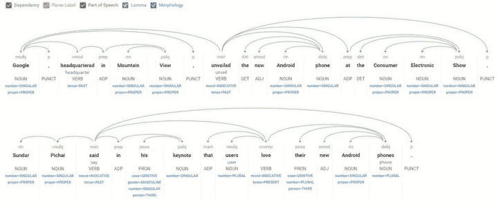
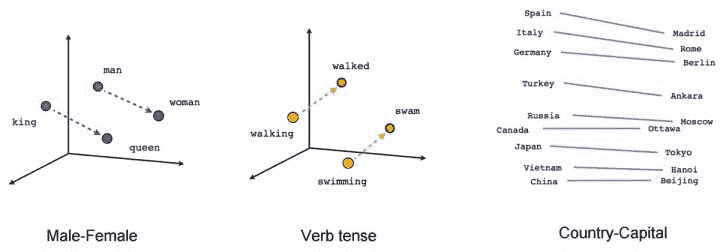

# 查询理解 101 -阿尔戈利亚博客|阿尔戈利亚博客

> 原文：<https://www.algolia.com/blog/product/query-understanding-101/>

## 什么是查询理解？

查询理解是分析搜索查询并将它们翻译成能够产生更好搜索结果的增强查询的过程。这是伟大的搜索体验的最重要的关键之一。

## 有哪些查询理解的例子？

查询重写、同义词、拼写纠正、分类、NLP、矢量化、二元和三元模型检测，用于查询分段、语义查询理解、个性化、本地化和查询范围(属性映射)。

## 查询理解对伟大的搜索结果有多重要？

绝对重要。人们会犯很多[拼写错误](https://archive.google.com/jobs/britney.html)而且语言也天生模棱两可(“测试”、“移动”、“应用”、“夏天”、“北方”都是名词；“美洲虎”是一辆汽车、一个操作系统、一种动物等。).人们还使用俚语，并提到在结果项文本中根本不一定会提到的事情(例如，“14 号鞋”、“公园附近”、“下周四晚上”等)。).所有这些都需要转换成有意义的东西，以便更好地查询底层数据结构。

此外，查询理解还可以用于对结果进行优先级排序。例如，从历史上看，在美国或澳大利亚，当人们在政府网站上搜索“驾照”时，他们最常寻找的是驾照更新页面，而不是其他数百个提到“驾照”的页面。历史性能数据可以自动提升首选目的地的值，即使在查询本身中没有指示它是最重要的。

查询理解通常是对搜索技术的巨大考验。如果您需要将“size 14”映射到一个大小属性，或者将“next Thursday”映射到一个时间过滤器，或者自动拼写正确的查询，该怎么办？您当前的实现能做到这一点吗？如果没有，那么你就让你的客户感到沮丧，落后了。

## 从哪里开始查询理解技巧？

许多非常有用的查询理解技术，如同义词、拼写纠正和语义，都属于 query *重写*的家族，其目的是修改查询以更好地表示查询意图，从而提高整体精度和/或召回率。这些技术的应用顺序会显著影响查询结果和处理复杂度。下面是一些最常用的技术。

## 同义词

同义词相当简单。他们通常是作为一个替代现实运行的，所以如果有人搜索“巨大的鞋子”，这可能会扩展到“(巨大或巨大的)鞋子”。这很简单，但如果要确定哪个应该优先考虑，可能会更复杂。如果使用机器学习(例如，通过单词嵌入)来生成同义词，则还会更加复杂。较新的语义搜索功能，如[矢量搜索](https://www.algolia.com/blog/ai/what-is-vector-search/)，内置了对相似、常见术语的理解，因此无需创建额外的同义词库。我们将在下面详细讨论这一点。

## 拼写纠正

拼写纠正可以以不同的方式工作。一种方法是通过想出一个最可能的替代词来纠正单词，然后允许用户覆盖它。另一种方法是宽容，允许最多两个字母的拼写错误。这叫错别字容忍度。然而，最好的选择并不总是正确的(语言含糊不清)，而且犯错的惩罚非常高，因为人们可能会失去信心并放弃。像同义词一样，矢量搜索解决方案可以帮助解决许多常见的拼写错误。

Spell correction and typo tolerance is a powerful query understanding tool that is deceptively difficult to execute well.

拼写纠正的另一种方法是查看每一个可能的变体并运行它们。这可能会很快爆炸，并降低查询速度。为了保持查询速度，搜索引擎必须以牺牲查询灵活性为代价，将排序算法的优先级放入数据结构本身。根据您的应用，这可能是也可能不是一个好的权衡。

我们的拼写纠正技术(在撰写本文时)是多种技术的结合。它会查看备选方案，但可以使用距离根据搜索者意图[的可能性来有效地权衡它们。这非常有效，不仅可以从查询数据中训练，还可以从结果项本身——产品名称、标题等——中训练。它可以立即理解您的数据——以任何语言——然后随着时间的推移通过更多的查询继续改进。](https://www.algolia.com/doc/guides/managing-results/optimize-search-results/typo-tolerance/)

## 查询分类

查询分类有助于搜索引擎预测最相关的类别或项目选择。搜索模型将使用以前的搜索和来自您站点的搜索数据来预测某个查询属于某个类别的可能性。在 Algolia 的[查询分类](https://www.algolia.com/doc/guides/algolia-ai/query-categorization/)中，我们使用基于向量的语义模型来预测搜索查询最有可能与哪些分类相匹配。

## 语义查询理解

语义查询理解是实际尝试理解查询意图的过程。语言本质上是非常模糊的，一词多义的概念恰当地描述了为什么这对于搜索来说是一个问题:“poly”意味着多重，“semy”在这种情况下意味着各种意义。“银行”是这方面的经典例子；这是指金融机构还是河边？不加上下文，很难知道。尤其是英语，例子比比皆是。幸运的是，有一些方法可以解决这个问题。

对于包含多个单词的查询，上下文通常更明显。对于单个搜索词，这更困难，但是在这些情况下，过去的查询序列历史可能是有用的。例如，如果有人搜索“atm ”,然后搜索“bank ”,那么第二个查询不太可能与河边有关！

分类也可以用来理解查询意图的类型。这对于搜索具有多种不同数据类型的数据集的查询框非常有用。LinkedIn 就是一个例子，在那里你可以搜索公司、人、工作等。每个查询的历史模式有助于预测最可能的结果类型。电子商务是另一个例子，其中支持查询不同于产品搜索。例如，搜索“退货鞋”应该包括退货的结果，而不是显示购买的鞋。

LinkedIn is a good example where the search intent can be highly ambiguous. Data is key to getting the intent right more often than wrong.

## [<svg aria-hidden="true" class="octicon octicon-link" version="1.1" viewBox="0 0 16 16"></svg>](#natural-language-processing-nlp)自然语言处理

NLP 是分析非结构化文本以推断结构和含义的过程。在这种情况下，结构指的是高度定义的信息，例如类别或数字，很像数据库中的字段。它还可以表示事物之间的关系。常见的例子包括大小、颜色、地点、名称、时间、实体和意图，但还有更多。当底层数据具有大量可以从查询映射的结构时，NLP 最有价值。

NLP 还将解析查询，使其更容易理解。一个常见的例子是使用词干将术语还原到它们的根——“运行”和“运行”变成“运行”。通过将单词映射到词干，我们可以识别同义词以改进查找。NLP 还将有一个停用词列表，如“the”、“is”、“and”和其他常用术语，以减少查询中的噪音。

Natural language processing (NLP) is getting closer to the human level interpretation of written language.

## 查询范围界定

NLP offers user-friendly search capabilities.

 *查询范围可以使普通的文本搜索显得高度智能。这种技术试图在查询中找到不一定匹配非结构化文本(反向索引)的结构，而是直接映射到结构化数据属性。

一个例子可以是查询“黑色 14 号篮球鞋”。产品信息不太可能提到文本“size 14”，但是尺码很可能出现在相关产品的尺码列表中。“黑色”可能是描述中的颜色，但也可能映射到更具体的颜色属性。所以这个查询实际上可能删除了这个文本，只查询“篮球鞋”，但同时过滤结果集为 size=14，color=black。这极大地提高了精确度，并且在严格和基于搜索的情况下也可以提高召回率。

上述技术的缺点是理解具有潜在混合含义的查询。对于示例查询“size 6 nike ”,尺码可以是指鞋的尺码，可以是男式、女式、儿童、美国、英国或其他，衬衫尺码，运动胸罩尺码，或者甚至是篮球尺码！过度过滤(或过度提升某些结果)会导致精确度的显著降低。

尽管存在潜在的问题，但好处远远大于坏处。实现这种技术的典型方法是从查询中删除特定的文本，并将其转换为结构化操作(即过滤或提升)。这允许人们使用自然语言来描述他们想要的东西，并将其转换成比原始的非结构化查询更有意义的东西。

最后，如果一个结构没有出现在您的记录中，这并不意味着您不能自己生成它。索引时间分析和数据提取是为信息添加结构的强大工具。聚类、分类、主题建模、标记和实体提取只是一些可用的强大技术。

## 词语嵌入

矢量化是将单词转换为向量(数字)的过程，这使得它们的含义能够以数学方式进行编码和处理。这是语言翻译和许多其他惊人应用的基础。向量的神奇之处在于它们也可以加减，所以文本的意义也可以加减。在实践中，向量被用于自动化同义词、聚类 documents‍、检测查询中的特定含义和意图以及对结果进行排名。

The well-known word-embedding technique word2vec illustrates how language can be converted into mathematical vectors that retain meaning. It’s even more surprising the context can be added and subtracted mathematically that retains meaning.

## 查询分割

查询分段是识别标记序列的过程，这些标记序列在一起比它们单独起来更有意义。这有助于通过不返回部分段的结果来提高精度。两个单词和三个单词的短语(在这种情况下是二元模型和三元模型)是有用的，因为它们可能比单个单词(一元模型)有更多的含义。

例如，以短语“纽约”为例。这两个词本身意义不大，但放在一起显然很有意义！因此，它们可以合并成一个术语，甚至可以有反向索引，而不是单独处理。我们可以查找这两个词的索引，并计算出它们何时按顺序排列，以导出短语匹配，但是 a)这更复杂，b)我们可能不希望人们搜索“new”时得到“new york”的结果。此外，如果人们搜索“new ”,可能会匹配包含“new york”的结果。这对于[强化学习](https://en.wikipedia.org/wiki/Reinforcement_learning)和其他我们不希望机器学习不公平地惩罚部分匹配的技术来说也是有问题的。希望这没有让你迷失，但是关键点是最大化信息上下文。

像英语和法语这样的语言使用空格来分隔单词，但是像中文、日语和朝鲜语这样没有分隔符的语言需要额外的分割算法。在 Algolia，我们还在图书馆中内置字典。从问题的左边开始，Algolia 将[尝试使用已知的字典术语分解查询](https://www.algolia.com/blog/engineering/natural-languages-in-search/)。在不确定的情况下，我们优先考虑最大化单词长度同时最小化不属于已知单词的字符数量的解决方案。

## [T10<path fill-rule="evenodd" d="M4 9h1v1H4c-1.5 0-3-1.69-3-3.5S2.55 3 4 3h4c1.45 0 3 1.69 3 3.5 0 1.41-.91 2.72-2 3.25V8.59c.58-.45 1-1.27 1-2.09C10 5.22 8.98 4 8 4H4c-.98 0-2 1.22-2 2.5S3 9 4 9zm9-3h-1v1h1c1 0 2 1.22 2 2.5S13.98 12 13 12H9c-.98 0-2-1.22-2-2.5 0-.83.42-1.64 1-2.09V6.25c-1.09.53-2 1.84-2 3.25C6 11.31 7.55 13 9 13h4c1.45 0 3-1.69 3-3.5S14.5 6 13 6z">T12</path>](#personalization)个性化

[个性化](https://www.algolia.com/blog/product/how-any-business-can-benefit-from-personalization-and-recommendations/)是根据正在搜索的个人向查询添加额外信息的过程，以改变与个人更相关的结果。这可以简单到衣服尺寸偏好、性别、地点或任何其他可能影响其结果的个人特征。

通常，个性化的第一阶段是通过查询发送信息，以便用其他分析记录。然后可以离线分析性能影响，以确定这是否有价值。应该注意，从商业智能的角度来看，这本身是有用的，即使它不用于个性化。

Often queries can be layered with personal information to augment and influence queries to produce highly personalized results

## 本地化

本地化是使用搜索者的位置来增强结果的过程。Meetup 就是一个很好的例子。谷歌还经常提示用户启用定位服务，这样它就可以提供本地搜索结果。它也可以从查询文本本身中提取(参见上面的 NLP ),就像房地产和工作搜索引擎通常所做的那样。

请注意，这可能会引起问题。例如，澳大利亚的地理定位准确率不到 80%，所以你会把大量的人放在错误的随机城市，甚至可能超过 1000 英里。这些怪圈通常是可航行的，但设计时要小心，并在假设位置不正确的情况下始终考虑 UX 流量。Meetup.com 就是一个例子，它的位置对于搜索来说是如此的重要，以至于它现在已经深深地融入了搜索 UX。思考一次错误猜测的代价通常是值得的。对查询的理解永远不会尽善尽美，所以通常最好让用户能够轻松地进行自我选择。

Meetup.com integrates location selection directly into the search bar.

## 语音搜索

基于语音的查询正在增加，这只是进一步增加了对高级查询理解技术的需求，主要是因为网络搜索最初训练我们缩短查询(更多文本=更少结果)。但是语音搜索已经增加了查询长度，并且在查询中包含了更多的结构。讽刺的是，语音翻译可能会弄错单词，但拼写是完美的，所以这提出了其他挑战。

## 查询理解提示

查询日志是您的朋友，应该帮助您设置查询理解的优先级。例如:

*   高容量的零结果搜索指向机会。他们为什么失败了？
*   如果没有人使用自然语言和/或您没有结构良好的信息，那么查询范围可能就没什么用了。
*   如果商业语言不能很好地翻译成客户语言，同义词可能会有用。
*   你的客户会犯拼写错误吗？频率如何？如果他们犯了很多错误，那么纠正无疑会有所帮助。

像矢量化和个性化这样的高级技术应该放在最后，因为它们需要更多的努力。虽然个性化搜索看起来更像是圣杯，但通过正确处理基本问题，可以提取更多的价值。毕竟，将糟糕的结果个人化是没有用的。*