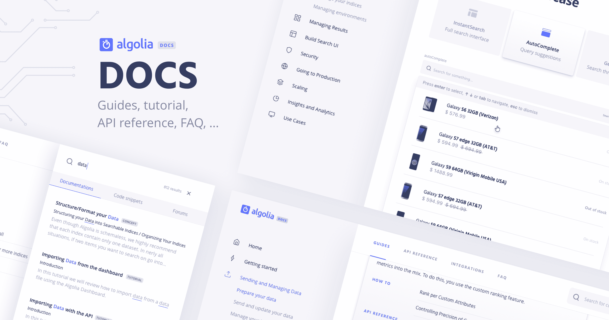
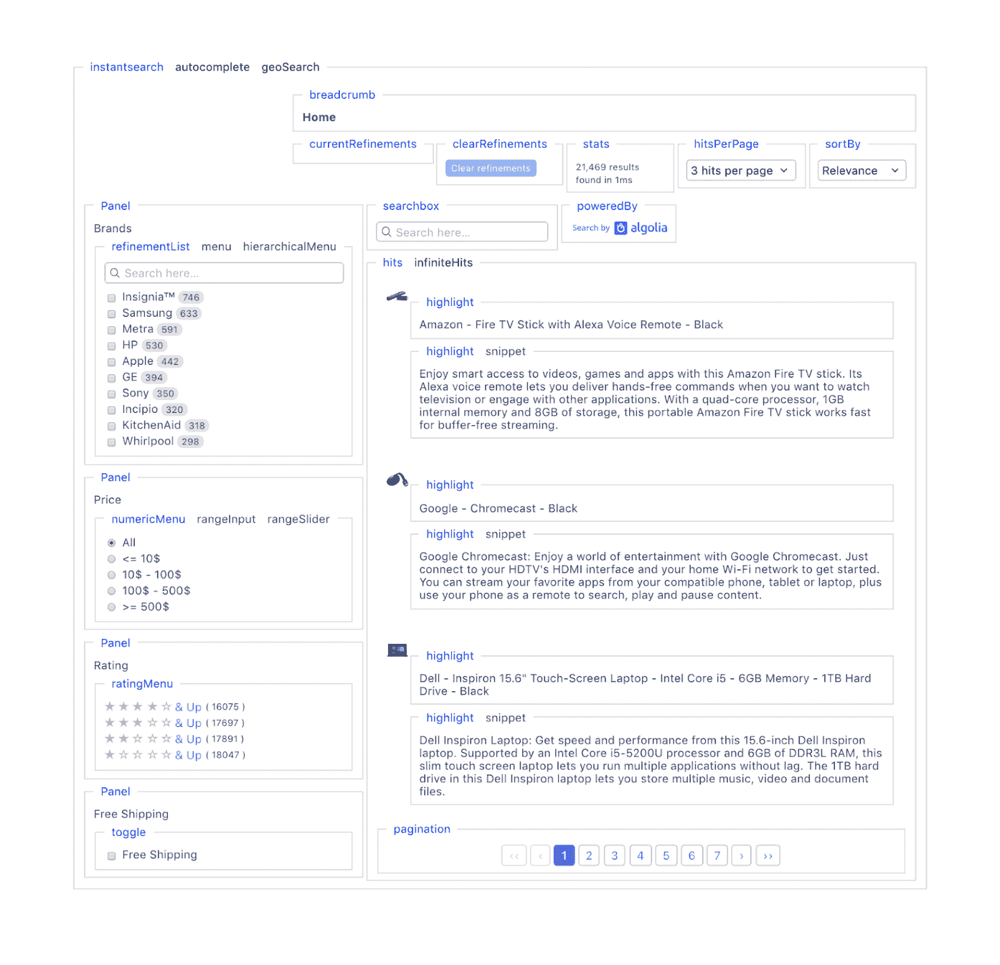
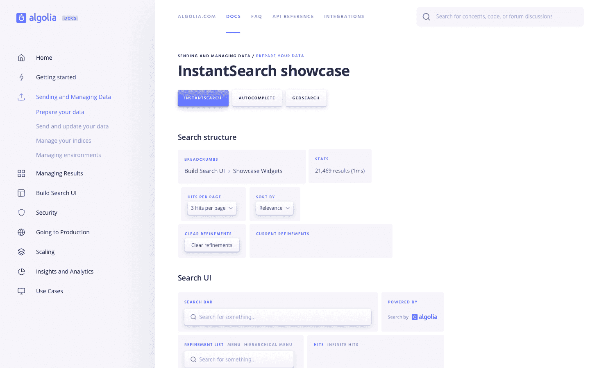
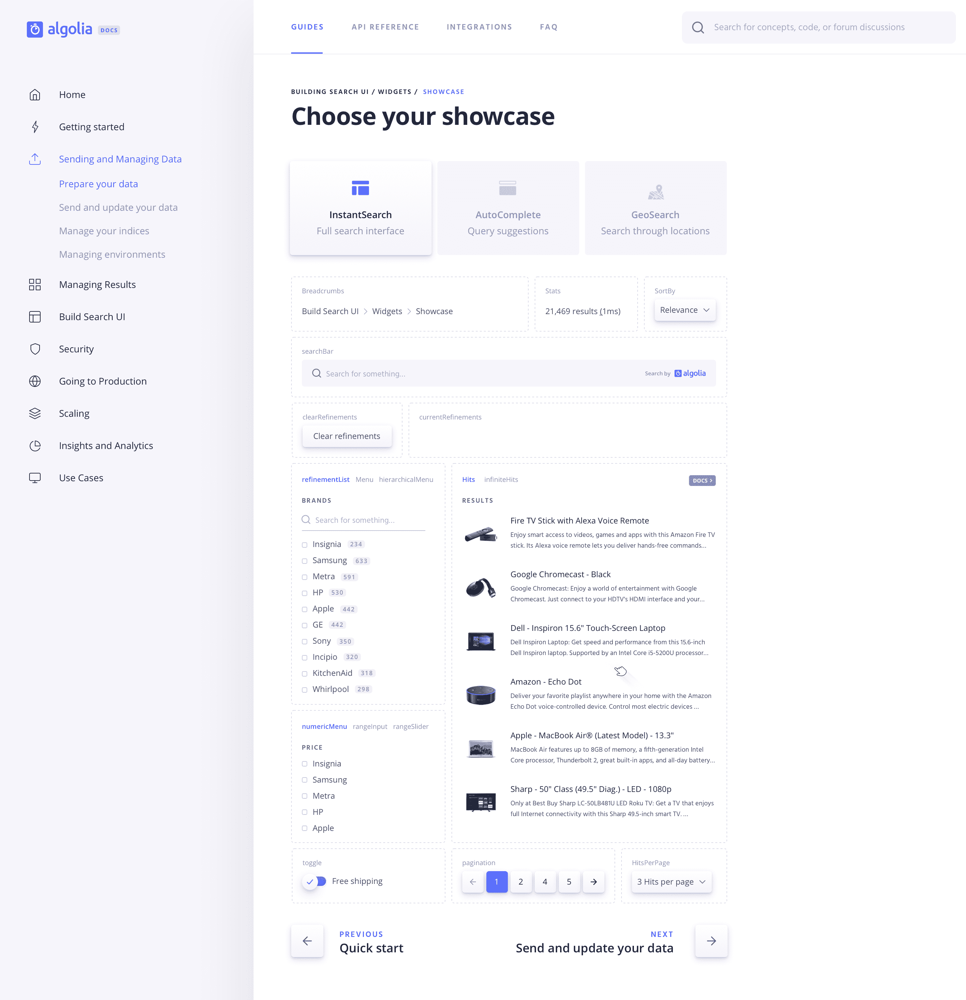

# 重新设计我们的文档-第 3 部分-UX/UI 阶段- Algolia 博客

> 原文：<https://www.algolia.com/blog/ux/redesigning-our-docs-part-3-the-ux-ui-phase/>

> ### *这是七篇 [系列博客](https://www.algolia.com/blog/engineering/redesigning-our-docs-part-1-why/) 中的第三篇，描述了我们最近对我们文档的架构和内容所做的更改。我们在这里关注用户测试和 UX/用户界面选择背后的决策过程。*

*“从问题入手。* *而且在你知道你要解决的问题之前，不要去想解决的办法。”*

当我们着手 [重新设计我们的文档](https://www.algolia.com/blog/engineering/redesigning-our-docs-part-1-why/) 时，这是我们的产品设计师[萨沙·普罗霍洛娃](https://www.algolia.com/blog/algolia/faces-algolia-meet-sasha-prokhorova/)、 所说的话。

对我们来说，这是非常明显的。虽然我们的文档包含了大量的信息，但我们从来不确定我们的读者知道会发生什么。文本和示例代码的混合并不完美，我们经常在同一个页面上混合不相关的信息。此外，我们没有提供简单的导航:我们在菜单中使用的单词，以及我们组织主题或显示超链接和行动号召的方式，并不总是符合我们读者的期望。

等到莎莎赶到的时候，我们已经开始 *解决* 的问题。我们已经重新设计了我们的文档(至少在纸面上),包括新的菜单结构、改变的层次结构和新的页面布局，以便更清楚地标记文本和代码之间的区别。换句话说，我们使我们的架构和内容适应了 [我们读者的不同目的](https://www.algolia.com/blog/engineering/redesigning-our-docs-part-1-why/) 。

显然，她忙得不可开交。她面对的是一群经验丰富的开发人员和技术作家，他们已经对问题及其解决方案有了清晰的想法。

她打算教我们什么？

嗯，从她 UX 设计的第一天到最后交付，很多惊喜都在等着我们。最终，即使我们最初对问题和解决方案的分析没有发生巨大变化，在产品设计阶段，许多额外的事实和细节浮出水面，迫使我们重新考虑我们最初的一些假设。这提醒了我…

*“不要根据假设行事”，* 她说。

# **与产品设计师一起打牌**

因此，萨莎测试了我们的假设，向我们介绍了一些 UX 工具:

*   卡片分类 帮助我们提高了新的等级和词汇。我们要求随机的用户把我们的主题放入他们自己的措辞和类别中。虽然有些选择证实了我们最初的直觉，但有些选择却让我们大吃一惊。
*   **团队研讨会** 给了我们时间反思导航和新的页面布局。例如，我们花了一整天来设计我们最重要的页面布局。团队的每个成员都提出了一个设计，然后我们选择了每个设计的最佳方面，并组合成一个新的页面布局。
*   **对高级用户的早期用户研究** 让我们对当前文档有了特别的了解——好的和坏的。
*   **与外部用户的面对面访谈** 让我们对我们的新架构有了一个客观的了解。
*   **匿名用户视频用户测试** ，匿名用户在使用我们的文档和回答用户调查 时被录像。这最后一轮测试为我们提供了对特定内容领域的宝贵见解，提供了对我们的词汇、内容流、主题方法以及代码和示例质量的见解。

在收集了六个月的用户反馈，并反复讨论不同的建议后，我们向我们的 UI 设计师提交了最终的 UX 设计——还是在纸上。团队-被前期设计的抽象本质和腿部工作弄得筋疲力尽-很高兴最终向前迈进，看到这个艰苦的工作被我们目光敏锐的 UI 设计师赋予了一个充满活力的三维空间。

故事就这样进入了用户界面阶段。

****

# **但是…从用户界面的角度来看，是什么造就了伟大的文档？**

UI 工作不仅仅是让事情变得漂亮，它还涉及到我们与任何给定网站的交互方式，以及如何在视觉上让文档清晰、易用、更自然。所以在重新观看了我们在 UX 阶段录制的用户采访视频后，我们能够 **与我们的观众产生共鸣** 。例如，看到像众所周知的 Cmd/Ctrl-F 这样的导航习惯来跟踪页面上的内容片段，或者发现开发人员对简单性的偏好(这源于他们对不太以 UI 为中心的代码编辑器和命令行控制台的使用)，使我们相信我们需要直接解决这些期望——特别是因为 Algolia 正在迅速成为技术领导者。

# **不要去猜，直接问。**

用户界面的使用方法与 UX 相同。你会对设计选择有直觉，严重依赖众所周知的 UI 模式，你可以理所当然地认为这些模式是好的实践。然而，每个网站都有一系列特定的挑战，在这种情况下，有些挑战太重要了，不能仅仅依靠假设而忽视。从能够切换编程语言和与代码片段进行交互，到处理版本控制，到展示由复杂组件组成的库，…，我们需要更多关于什么可行什么不可行的信息。

幸运的是，开发者喜欢解释他们为什么使用某个特定的服务，所以我们试图利用这一点。在对其他在线文档进行基准测试，并对一系列 UI 布局和想法进行注释的同时，我们在 Twitter 上发起了一个反馈呼吁，这成为了网络上最受赞赏的文档的黄金线索。反应是惊人的，我们很快了解到什么是最先进的文档:深入的代码示例、清晰的文字、良好的可读性、学习曲线、可交互的内嵌控制台等等。提取这些答案，并标记每一个论点，我们开始揭示趋势，这些趋势给了我们一些线索，让我们知道人们在使用文档时会产生什么样的共鸣。

# **模板化。**

我们的文档是用 markdown 语言编写的模板集合，这些模板用于 [生成静态网页](https://www.algolia.com/blog/engineering/api-documentation-choosing-right-tool/) 。因此，在与写作团队的共同努力下，我们开始列出我们想要展示的每一种内容，看看它们包含什么，并对每一种内容附加高层次的目标和期望。有点像设计系统建造者，你不会从一堆希望作为一个整体一起工作的小组件开始；相反，你从一个模板开始，重点关注你想要实现的目标，并确保避免阻碍读者学习的元素。我们确信，如果设计得好，这个页面将为我们的整个 UI 设定全局方向。

# **取网络媒体之精华。**

文档意味着承载大量的信息，涵盖复杂的主题，最终会生成包含许多不同种类信息的长页面。这样，很明显，我们需要遵循媒体巨头的标准，他们不断优化他们的网页，以获得最佳的可读性，让读者更容易消费大量的信息。

因此，作为整个 UI 的基础，我们决定从我们最重的页面之一开始，它包括大量的 UI 组件，如长文本区、提醒、警告、旁注、代码片段、附加资源链接、反馈表和视频。我们的想法是，如果我们能找到一个适用于这个页面的设计，它将适用于 90%的文档。

# **可用性高于美学——一些最佳实践。**

*   使用非常窄的内容宽度来显示短文本行比使用全宽度的句子更容易阅读，后者会让你在从一行到下一行的过程中迷失方向并感到疲劳。最好的标准是保持 600 到 700 像素宽。我们选择留在中间，平均每行保持 150 个字符。
*   我们的技术作者已经在拆分内容方面做得非常好，给我们一些小段落，而不是一大堆文字。到目前为止，大多数用户对滚动都很满意，尤其是那些喜欢 Cmd/Ctrl-F 导航的开发人员，他们喜欢在一个页面上显示所有内容。让你的内容鲜活起来，通过理解你的目标读者喜欢的阅读方式来让它具有可读性。
*   为了让长时间的阅读过程更舒适，我们选择了读者容易看到的字体大小。例如，用户不需要放大才能阅读，尤其是如果你的产品不符合他们的标准，他们不会跳过你的产品。不要让他们打破你的布局，因为他们觉得需要放大和缩小。可用性高于美观。
*   我们在设计时考虑了可访问性:不要依赖吸引注意力的颜色；确保你的配色方案能给色盲人士带来价值和理解；最后，检查您的主对比度，以确保即使在低分辨率屏幕上也有良好的可读性。

经过几十次测试，我们最终达成了一个令开发者 *和* 满意的平衡，并与我们公司的品牌保持一致——因此，我们所有的在线内容都以相同的基调和氛围传递一致的信息。

# **组件展示挑战。**

从设计的角度来看，我们最大的挑战之一是 [即时搜索组件展示](https://www.algolia.com/doc/guides/building-search-ui/widgets/showcase/js/) 。这个 showcase 需要完成几个目标:允许用户试验完整的交互组件库；作为每个组件背后的文档的中心；并强调每个组件可能的变化。从设计的角度来说:它需要作为一个整体工作，同时单独突出每个组件，并在视觉上清楚地表明每个组件可以有几种变化。

以下是我们在动员会上达成的共识:

字面意思，盒中盒中盒。尽管这份初稿在展示全球信息层级方面表现得很好，但还是有一些挑战。为了鼓励用户去尝试，需要有一种方法让用户一眼就知道这是一个搜索演示。它需要清楚地将每个组件识别为具有精确目标的单个实体。

我们将免去你所有的界面探索。本质上，我们遵循我们在 UX 阶段做出的信息架构选择，确保我们的设计实际上符合我们的观众的期望。

> *我们通过自己的眼睛看世界:工作经历、教育、文化……我们对设计的理解都有偏见。为了平衡这一点，你需要挖掘你的受众现在使用什么来完成它的任务，并在此基础上进行构建。这对每个人来说都应该是一个迭代的过程，而不是与他们以前所知道的一切完全脱节。 换句话说，不要重复发明现有的和众所周知的模式:在现有模式的基础上构建，同时努力使它们适应你自己的用例，并使它们对最终用户更有价值——即使你自己不一定发明了什么东西。*

解决了整体的问题后，我们把重点放在为每个组件及其变化带来微妙而明显的细节上。将每个组件拆分成单独的容器是从视觉上单独展示它们的第一步。为每一个组件添加一个小的标签菜单也很重要，这样用户就可以在组件之间切换，并且仍然可以与整个演示进行交互。最后，在每个块上添加一个悬停状态解决了访问文档的问题，从而避免了让用户淹没在对每个组件持续可见的大量链接中。

# **下一步:优化和迭代。**

现在新设计已经推出，接下来就是关注我们的重要指标，确保主要问题得到正确解决，我们的决策将对业务产生积极影响。

对于跟踪所有反馈——无论是好的还是坏的——对持续反映设计的整体体验和性能有多重要，我们无法多说。这可以让你知道你的 UI/UX 的优势和最常用的地方。即使项目已经完成，知道哪些问题仍然存在，并在你被动地思考 解决方案时，让它们在你的脑海中酝酿 也是很好的。在一天结束时，保持某种客户旅程的更新将有助于您识别和传达快速成功，并仅用少量资源消除负面印象。

请继续关注更多迭代——我们将为您带来许多激动人心的变化！但是在我们走向未来之前，让我们从技术角度出发，看看 UI 新的[性能驱动的 CSS 架构](https://www.algolia.com/blog/engineering/redesigning-our-docs-part-4-building-a-scalable-css-architecture/)。