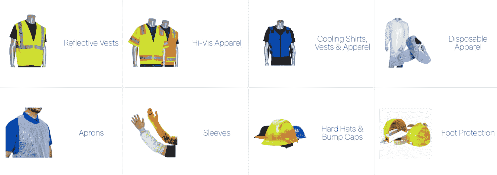
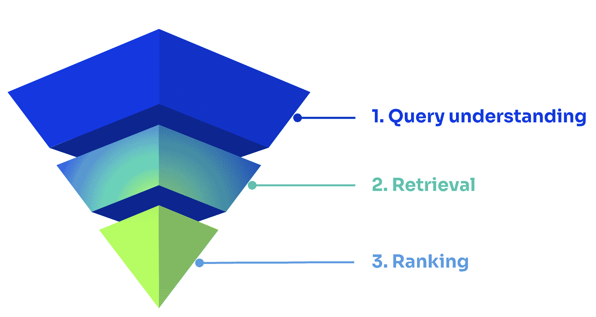
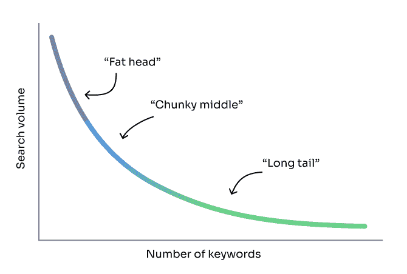

# 用人工智能扩展市场搜索- Algolia 博客

> 原文：<https://www.algolia.com/blog/ai/scaling-marketplace-search-with-ai/>

很明显，对于在线业务，尤其是市场，由于必须管理大量数据，内容发现可能特别具有挑战性:数百万个库存单位(SKU)被分成数百个不同的类别；与产品描述和图像相关的万亿字节数据；成百上千的不同供应商发布内容；以及具有最低质量控制的用户生成的内容(例如，评论)。

这是机器学习真正可以大放异彩的领域之一，它可以改善甚至最大的 B2C 或 B2B 市场目录的内容发现。在这篇博客中，我将分享为什么我们如此看好 AI(人工智能)如何推动搜索和优化跨市场的发现。

## 网上商城搜索查询的复杂性

购物者通常清楚地知道自己想要什么，有时他们会寻找可能的解决方案。特别是在市场上，搜索栏上的 [旅程从](https://www.marketingcharts.com/industries/retail-and-e-commerce-113138) 开始。

研究 UX 电子商务的 [贝玛研究所](https://baymard.com/blog/ecommerce-search-query-types) 确定了买家输入的各种类型的查询，包括:

*   特定搜索，如“iPhone”或 SKU 号码
*   功能相关搜索，如“无蜡香膏”
*   兼容性搜索，如“mpr 兼容过滤器 10，000 平方英尺”
*   症状相关搜索，如“帮助入睡的东西”

面对如此广泛的查询类型，搜索引擎很难解释它们，并给出最相关或最正确的选择。更复杂的是，语言常常是模糊的。“银行”可以指金融机构，也可以指河边。查询中单词的顺序也很重要。买家并不总是按照他们想要的顺序输入单词，使用拼写错误的单词，或者使用长尾短语来描述他们想要的东西。搜索“飞捕鱼”是非常不同的“捕鱼飞”。

A result for “fishing fly” (above) is different from a search for “fly fishing”

这个问题变得更加复杂，因为市场中的商品通常被放在一个或多个类别中，例如下图所示的安全背心。理想情况下，搜索引擎会从正确的类别中提供正确的产品，但为此，它们需要理解意图。

Search engines use data such as categories to improve results, and sometimes items are placed in multiple categories, which helps for browsing, but can be difficult for search.

搜索栏需要处理所有这些类型的查询，并立即返回结果。像自动完成这样的功能可以改进这个过程，但是自动完成的效果取决于它所使用的算法。

## 如何提高精确匹配和相似搜索

概括地说，搜索有三个阶段:理解查询、检索数据和对结果进行排序。

搜索引擎已经使用自然语言处理(NLP)引入了非常复杂的查询理解技术。在这个过程的后端，排名受到各种因素的影响，从营销和个性化，到点击，最近的转换和其他信号。然而，迄今为止最难的部分是检索。

在过去的二十年中，通过关键字搜索技术来管理检索，该技术执行查找以将关键字与它们在搜索索引中的位置相匹配。更复杂的信息检索技术 [如 BM25](https://www.algolia.com/blog/ai/the-past-present-and-future-of-semantic-search/) 提高给定查询的相关性。然而，即使改进了查询匹配，网站所有者仍然需要添加规则、同义词、关键字和语言包来管理错误和避免可怕的无结果页面。

举一个搜索 USB-C 线缆的简单例子。查询可以作为“usbc”vs“USB-c”或“usbc”提交。搜索这些不同的变体可以返回许多结果、没有结果或不匹配的结果。这些问题有解决方法，但它们可能非常耗时且永无止境。

最近解决这些问题的一项创新是引入了 [向量嵌入](https://www.algolia.com/blog/ai/what-is-vector-search/) ，并使用深度学习来更好地理解搜索者的意图。关键词(及其相关标记)相对于搜索来说是二进制的，特定的单词要么存在，要么不存在。与关键字相反，AI 搜索使用向量的数学来允许接近度的测量(例如，终端设备和 HVAC 在向量空间中非常接近)，因此文本的关系不再是二元的，而是分布的。向量可以使用数百，有时数千个维度来确定意义。

尽管矢量搜索非常擅长根据相似性提供结果，但关键字搜索仍然为某些类型的查询提供了巨大的价值。当我们将这两种技术结合到一个查询结果中时，这种“混合搜索”提供了更多的相关性。基于关键字和人工智能评分的组合，结果从最相关到最不相关排序。然后，优化后的结果被发送到排序阶段，以便根据机器和用户定义的规则进行最终排序。然而，要大规模做到这一点，需要一种全新的数据处理方法。

## 人工智能检索模型

我忽略了其中最重要的一部分:优化市场规模的向量。规模和速度对于取得好成绩绝对至关重要。亚马逊发现，每 100 毫秒的延迟会让他们的销售额下降 1%，Akamai 发现了类似的结果，即 100 毫秒的延迟会影响高达 7%的转化率。( [来源](https://www.gigaspaces.com/blog/amazon-found-every-100ms-of-latency-cost-them-1-in-sales) )

向量是必须由专业 GPU 或高端服务器处理的大浮点数。寻找向量之间相似性的一些最著名的方法包括 HNSW(分层可导航小世界)、IVF(倒排文件)和 PQ(乘积量化，一种减少向量维数的技术)。每种技术都旨在增强特定的性能属性，例如使用 PQ 减少内存，或者使用 HNSW 和 IVF 快速而准确地缩短搜索时间。为了获得给定用例的最佳性能，通常的做法是将多个组件组合起来创建一个“复合”索引。

虽然这些技术非常好，但是它们的实现和运行成本非常高，而且对索引的任何更改都很脆弱。我们采取了不同的方法。我们使用 [神经哈希](https://www.algolia.com/blog/ai/vectors-vs-hashes/) 将矢量压缩或二进制化为其正常大小的 1/10。新的二进制向量的计算速度比非优化向量快 500 倍，这使得它们与简单的关键字搜索一样快，有时甚至更快。它可以在商用硬件和 CPU 上运行，因此市场可以立即向客户提供结果，而不会收取意外费用。

在市场规模方面，这种方法的优势尤为明显。电子商务企业和市场经常用新产品、顾客评论、库存变化、变化的搜索趋势等来每天甚至每小时更新他们的搜索索引。数以千计，有时数以百万计的变化发生。使用我们的方法，结果可以近乎实时地自动调整和重新优化。

结合关键字的神经散列通过优化所有查询提供了两全其美，从 [头部查询到长尾](https://www.algolia.com/blog/ai/how-ai-search-unlocks-long-tail-results/) 。由于预算紧张，利润微薄，以及全球争相寻找机器学习工程师和建立数据科学团队，大多数企业都负担不起在内部建立这种类型的混合人工智能检索。我们将我们的解决方案设计为一个可组合的、API 优先的解决方案，可以为任何企业提供开箱即用的出色结果。 [在这里报名](https://www.algolia.com/dg/neuralsearch-coming-soon/p/1) 了解更多。

## 为成绩排名

检索相关结果后，搜索引擎需要对它们进行排名。[Learning-to-rank(LTR)](https://www.algolia.com/blog/ai/an-introduction-to-machine-learning-for-images-and-text-now-and-in-the-near-future/)是一种机器学习的类型，提高排名，辅助精准。它包括监督学习、非监督学习和强化学习。也有类似半监督学习的变体。这些解决方案中的每一个都提供了人工智能排名功能，以提供比更简单的统计方法更好的结果。

点击、转化、签约、评分等正向强化。，可以用来自动提高排名。在 Algolia，我们的 [动态重新排名](https://www.algolia.com/doc/guides/algolia-ai/re-ranking/) (DRR)功能主要使用点击，因为有明显更多的可用数据(更快地获得更高的置信度)，但如果有足够的数据，我们也使用后来的事件。可以通过个性化、销售和其他策划的结果进一步细化结果。虽然客户可以依赖自动化，但他们仍然可以控制如何显示或重新排列结果。

我们强烈建议组织连接尽可能多的业务数据，以便自动优化搜索结果。事实上，真正的 AI 搜索也在不断地从点击流数据中学习。人工智能支持的检索和排名之间有一个聪明的相互作用。

*   更好的初始相关性推动了与访问者的更多互动
*   更高的点击率、转换率和其他积极信号提高了排名
*   这被反馈到检索引擎以提高相关性

## 商场零售商的下一步行动

亚马逊、易贝和市场提供商花费了数十年时间和数千名专业工程师来构建可扩展的人工智能搜索。借助我们的混合人工智能解决方案 Algolia NeuralSearch 搜索和发现，现在任何人都可以在几分钟内完成。更好的结果可以改善用户体验、整体转化率、客户终身价值、细分市场增长和其他 KPI。

Algolia NeuralSearch 搜索和发现即将推出！ [立即注册](https://www.algolia.com/dg/neuralsearch-coming-soon/p/1) 率先评估 Algolia neural search for your market place。