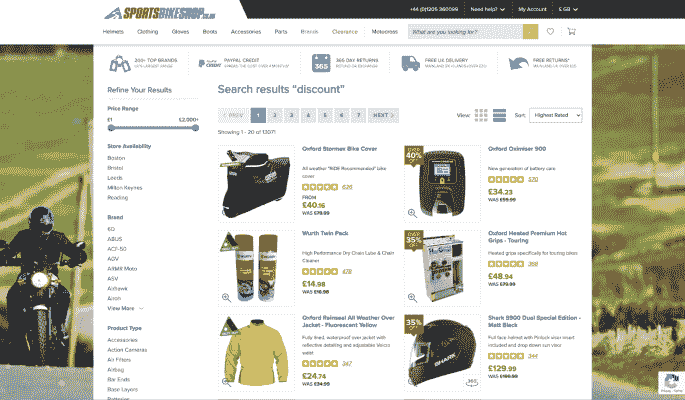
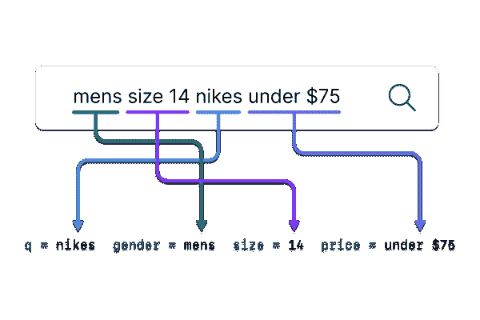

# 什么是搜索相关性？阿尔戈利亚|阿尔戈利亚博客

> 原文：<https://www.algolia.com/blog/product/what-is-search-relevance/>

搜索相关性是对搜索查询和搜索结果之间的关系的准确性的度量。

网络用户期望很高。由于像谷歌、亚马逊和网飞这样的网站设置了高标准，他们期望准确、相关和快速的结果。然而，现实是，许多网站没有优化的结果页面，这些页面能够理解用户的意图并轻松地满足他们的需求。

如果你曾经搜索过一个网站，却只能看到一堆无用的、不相关的结果，那么你应该知道你的用户可能会有什么感受:沮丧并倾向于去竞争对手的网站寻找结果。搜索相关性是用户体验不可或缺的一部分。

网站所有者可以微调他们的搜索相关性，以对用户最有帮助的方式排列搜索结果。这可以基于多个因素，例如搜索意图、业务优先级、文本相关性、拼写准确性、用户的地理位置或搜索内容中关键词的接近度。

### 微调搜索相关性以获得准确性

相关性可能很难确定，因为它高度依赖于上下文和许多不断变化的变量。例如，网站的类型很重要:电子商务网站和学术网站的排序方式是不同的。搜索者的类型也很重要。收藏家和新手会有不同的意图和搜索技巧。最后，不同的人会用不同的词来表达他们在寻找什么，即使是完全相同的查询。结果排名公式必须满足这些不同的需求。

当用户在电子商务网站上输入类似“折扣”的查询时，他们希望返回符合查询条件的特定记录子集。

When a user enters a query like “discount” on an ecommerce site they want a specific subset of records that match the query criteria to be returned.

## 为什么搜索相关性很重要？

优化 [搜索相关性](https://blog.algolia.com/how-algolia-tackled-the-relevance-problem-of-search-engines/) 是用户体验设计中一个极其重要却又经常被忽视的方面。研究显示，43%的网站访问者会立即进入搜索栏，而这些搜索者转化的可能性是普通人的 2-3 倍。当用户得到符合他们的查询和兴趣的结果时，他们会更满意，更投入，甚至更有可能转化。因此，一个好的 UX 设计应该鼓励用户从搜索栏开始，浏览搜索结果。

此外，现代在线用户对网站的可用性有很高的期望，因此速度、易用性和设计的简单性是客户如何看待一个品牌的重要因素。

## 搜索相关性简史

搜索相关性的历史可以追溯到互联网的早期，当时研究人员试图找到信息检索的方法来管理每天快速增长的内容。这很快导致了搜索引擎的发明。

### 搜索引擎

早期的搜索引擎和协议，如 1990 年由麦吉尔大学的一名研究生创建的 Archie 和 1991 年由明尼苏达大学的研究人员创建的 Gopher，是现代搜索相关性系统发展的重要里程碑。他们使学者能够使用搜索词搜索他们通过互联网连接的其他机构的文件系统。

然而，这些早期的搜索引擎仍然非常技术性，要求用户具有先进的计算机知识和低级的互联网概念。与此同时，就在几年后的 1993 年，随着数百个网站开始上线，万维网开始蓬勃发展，引发了全新的搜索系统浪潮。

### 早期网络搜索引擎

很快就出现了网络爬虫，它能自动加载和更新搜索引擎索引中的网页，允许搜索更多的内容。

网络搜索引擎，如 1993 年的 Excite 和 1994 年的 Yahoo，因其易用性而迅速流行起来。它们甚至包括一些基本的统计模型，旨在理解用户查询以及它们与内容的关系。

这些新颖的早期系统采用了一种可行但有限的方法来排列与用户最相关的搜索结果。他们根据关键词在网页中出现的次数进行相关性排名，但是他们没有考虑任何其他标准来评估网页的质量。

然后改变游戏规则的谷歌搜索框出现了。谷歌于 1998 年 9 月 4 日在加利福尼亚州门洛帕克成立，通过建立其尖端的搜索引擎技术，极大地提高了搜索的相关性。2000 年代，谷歌使用更新、更强大的机器学习模型改进了搜索算法，提供了更好的相关性和预测性搜索功能，如自动完成和即时搜索。

### 测量相关文档搜索

随着网站数量的增加，在特定网站和数据库中搜索相关文档的需求也在增长。文档搜索是我们今天网站搜索方式的重要先驱。

传统的排名系统通常会查看文档中关键词的频率来预测它们的相关性。例如，一种称为 TF-IDF 的经典算法会查看关键词在相应文档中出现的次数(术语频率)以及关键词在存储库中所有其他文档中出现的次数(逆文档频率)。后一种分析有助于过滤掉通常是噪音的常见单词，如介词。

虽然 TF-IDF 和其他此类早期相关性方法擅长通用文档搜索，但它们未能利用大多数网站包含的附加结构和元数据。现代内容包含标题、描述、类别、标签和更多基于关键字的信息，可用于解释网站内容和提高搜索相关性。

随着时间的推移，搜索引擎公司已经开发出 TF-IDF 的替代方案，例如，通过更多地依赖关键字算法而不是统计。对于我们自己的搜索引擎，我们开发了一个平局决胜和自定义排名系统，使企业更容易看到引擎盖下发生的事情，这使他们能够根据自己的需求定制相关性。

随着更新的语义搜索功能的出现，也有更复杂的排名质量模型来对搜索相关性进行评分，包括 nDCG，归一化的折扣累积增益，它可以确定一组查询结果对于特定查询的排序情况之间的相似性。分数越高，相关度越高。我们增加了神经技术和向量搜索的评分，以扩展我们的关键字搜索对更多用例的相关性。还有其他方法，如 MRR(平均倒数排名)和 MAP(平均平均精度)，每种方法都有自己的优缺点。

为了获得更好的相关性，搜索索引中记录的质量很重要。关键字和语义搜索的好坏取决于数据的质量，这就是为什么数据清理可以处理缺失值或有噪声的数据，构建来自不同来源的数据集以便更好地进行分析，以及改进标题、描述、标签、标题和元数据等内容可以极大地影响搜索质量分数。

## 实现搜索结果提升和优化

如今，随着网站内容和产品供应的增长，优化搜索相关性是单个网站搜索引擎的主要考虑因素。企业生产自己的相关性需要考虑到他们的具体业务需求，使他们的搜索有用。

例如，一个电子商务品牌可能拥有数千种不同的产品和不同人口统计的客户。因此，当客户搜索产品时，内部搜索引擎必须能够提供不仅与查询相关，而且与特定用户上下文相关的结果。

今天的搜索引擎还必须知道如何处理同义词、错别字、多词查询，甚至是问题。搜索引擎使用自然语言处理(NLP)来帮助阅读、理解和理解人类语言。

此外，营销人员可能希望推销与其店内商品类似的季节性商品 [商品](https://blog.algolia.com/what-is-searchandising/) 商品，或者企业经营者可能希望推销利润更高的商品。因此，相关的搜索系统还必须能够将这些因素考虑在内，并提供可以随着时间的推移进行调整以满足这些需求的自定义排名。

然而，这些算法中的许多仍然很笨拙。为了改善这一点，一些算法 [考虑了](https://blog.algolia.com/how-algolia-tackled-the-relevance-problem-of-search-engines/) 匹配属性的重要性和关键词的接近度。通过这样做，搜索结果比通用搜索算法更有可能与用户相关。

最近，为了提高相关性，搜索设计者一直致力于构建更多的个性化和情境化。这包括像机器学习和自然语言处理这样的技术，以实现更多的对话式搜索，跟踪用户搜索和浏览历史以允许对查询进行自定义解释，以及对网页进行自动标记和分类，以便在比简单的文本关键字更高的层次上理解内容。

## 用 Algolia 微调你的搜索相关性

优化网站的搜索相关性是一个复杂且持续的过程。它不仅需要提供与用户查询相匹配的结果，还需要为用户提供个性化的结果，同时满足您自己特定的业务需求。此外，随着用户越来越多地转向支持语音的设备和数字助理，企业将不得不找出如何提供一种新型的界面，能够与用户自然交谈。

为了向您的客户提供所有这些功能，您需要一个搜索即服务合作伙伴，提供所有行业最佳实践和现成的最先进功能。更好的相关性对于一个网站或内联网上的客户是获得好的搜索体验还是坏的搜索体验有着巨大的影响。